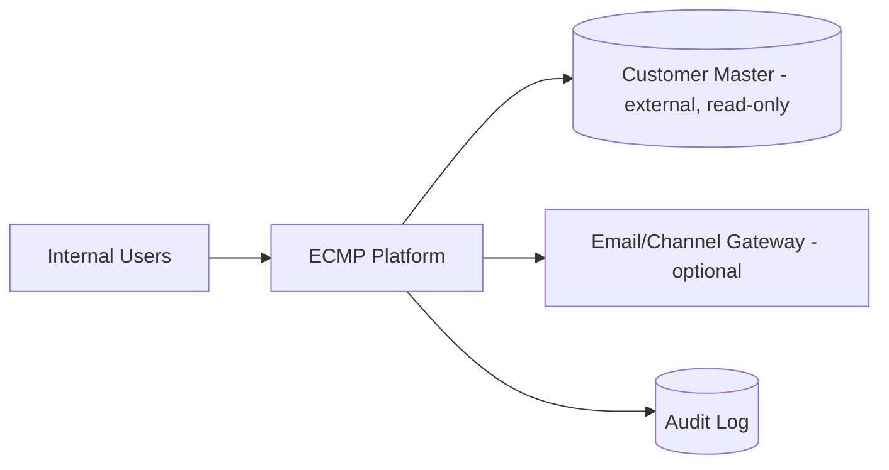
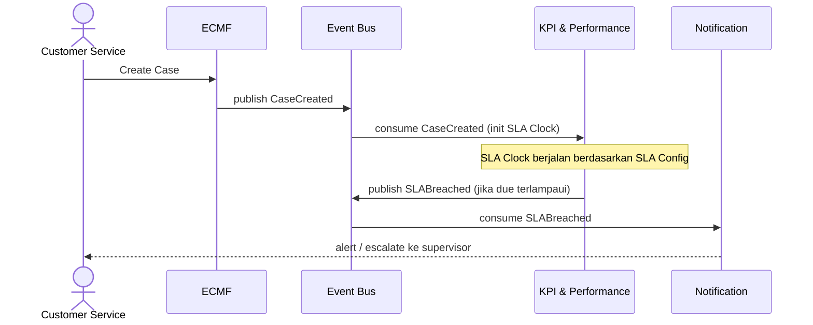

# ECMP Solution Architecture v1.0

| Field | Value |
|---|---|
| ID | SA-001 |
| Version | 1.0 |
| Owner | Solution Architect |
| Reviewer | Tech Leads, Security, Ops, BA Lead |
| Approver | Architecture Board |
| Status | 🟡 Draft |
| Last Review | 2026-07-21 |
| Next Review | 2027-01-21 |

## Purpose
Draft awal desain solusi teknis ECMP, diturunkan dari `01 Business Blueprint`, `02 Business Rules`, dan `05 Architecture Decision Records` (ADR-001, ADR-002, ADR-003). Source diagram (context, container, sequence, deployment) tersedia di `23 Assets/mermaid/` dan direferensikan dari §3, §4, §5, dan §9.

## 1. Goals & Constraints

**Goals**
- Mendukung 7 domain bisnis dari Blueprint (Core Platform, CRM, ECMF, KPI & Performance, Dashboard & Analytics, Notification, Administration) sebagai unit desain yang jelas batasnya.
- ECMF tetap responsif terhadap user meski domain konsumen (KPI, Dashboard, Notification) lambat/down — lihat ADR-001.
- Tidak menduplikasi ownership data pelanggan — lihat ADR-002.
- Perubahan proses bisnis rutin tidak memerlukan rilis kode — lihat ADR-003.

**Constraints**
- ECMP wajib terintegrasi dengan Customer Master eksternal yang sudah ada (di luar kendali tim ECMP).
- Keputusan teknologi backend **sudah diambil**: FastAPI + PostgreSQL (ADR-004); message broker **ditunda eksplisit** (ADR-009); frontend masih deferred — status lengkap di bagian "Open Decisions" (setelah §11).
- Audit trail harus immutable secara teknis (BR-CP-03), bukan hanya aturan proses.

## 2. Architecture Principles (Technical)
1. **Domain-oriented boundaries** — 7 domain di Blueprint menjadi batas modul/service, selaras `20 Domain Architecture`.
2. **Event-driven integration by default** antar domain (ADR-001); komunikasi sinkron hanya untuk operasi yang butuh respons langsung ke user (mis. validasi saat input).
3. **Read-only cache untuk data eksternal** (ADR-002) — tidak ada domain yang menjadi SoR untuk data yang dimiliki sistem lain.
4. **Configuration over code** untuk rule yang diklasifikasikan *Configuration* di `02 Business Rules` (ADR-003); rule *Hardcoded* diimplementasikan sebagai invariant di level aplikasi, tidak bisa dimatikan lewat config.
5. **Audit-first** — setiap write operation pada entity signifikan (Case, Config, Role) menghasilkan entri Audit Log yang tidak bisa diubah/dihapus melalui jalur aplikasi manapun.
6. **Idempotent consumers** — semua consumer event harus toleran terhadap duplicate delivery (at-least-once, ADR-001).

## 3. Context Diagram (naratif)
Aktor eksternal utama: Customer Service/Handler/Supervisor/Manager/Executive/Administrator (internal users), Customer Master (sistem eksternal, read-only), gateway email/channel eksternal (opsional, untuk Notification).

Diagram source: `../23 Assets/mermaid/ecmp-context.mmd` (context detail per domain).

## 4. Container / Component View (naratif)
Tujuh domain dipetakan sebagai container/service kandidat (granularity final menunggu ADR teknologi):

| Domain | Peran Utama | Bergantung Pada |
|---|---|---|
| Core Platform | Identity, AuthN/AuthZ, Organization, Config, Audit | — (fondasi, semua domain lain bergantung padanya) |
| CRM | Customer 360 view, cache read-only Customer Master | Core Platform, Customer Master (eksternal) |
| ECMF | Case lifecycle: create → assign → process → review → close | Core Platform, CRM (konteks), Administration (workflow/SLA config) |
| KPI & Performance | Kalkulasi metrik dari event operasional | ECMF (event), Administration (SLA config) |
| Dashboard & Analytics | Visualisasi operasional/eksekutif | KPI & Performance, ECMF, CRM, Core Platform (authz) |
| Notification | Routing & delivery notifikasi berbasis event | Semua domain (event source), Core Platform (recipient resolution) |
| Administration | Config, reference data, role-permission | Core Platform |

Event bus (teknologi TBD) menjadi tulang punggung komunikasi ECMF → KPI/Dashboard/Notification/Core Platform, sesuai `08 Event Catalog`.

Diagram source: `../23 Assets/mermaid/ecmp-container.mmd` (7 domain + event backbone outbox ADR-009 + Customer Master eksternal + gateway opsional; arah dependensi per tabel di atas).

## 5. Runtime & Sequence Views (contoh alur utama)
**Alur: Case dibuat sampai SLA breach terdeteksi**

Sequence lain (assignment, closure, config change) mengikuti pola yang sama.

Diagram source: `../23 Assets/mermaid/create-case-sequence.mmd` (create case Sprint-01 nyata: `POST /v1/cases` → validasi → stub CM → transaksi tunggal cases + audit_log + outbox EVT-001 → 201, per FR-001c/ADR-009).

## 6. Data Architecture
- Rujuk `06 Data Dictionary` untuk entity list per domain.
- Setiap domain memiliki data store sendiri (data ownership per domain, selaras prinsip #1); tidak ada shared database lintas domain — komunikasi data lintas domain melalui event atau API read, bukan akses database langsung.
- Customer Reference (CRM) adalah cache read-only, disinkronkan dari Customer Master (ADR-002) — mekanisme sinkron (event vs scheduled pull) masih Open Decision.
- Audit Log disarankan append-only store terpisah (mis. write-once log store) agar imutabilitas terjamin secara teknis, bukan hanya lewat permission aplikasi.

## 7. Integration Architecture
- **Internal (antar domain ECMP)**: event-driven melalui message broker (ADR-001), skema di `08 Event Catalog`.
- **Eksternal — Customer Master**: read-only — kontrak terdefinisi di `09 Integration Catalog/ECMP_INT_001_Customer_Master_Read_v0.1.md` (INT-001: mode stub Sprint-01, mode real dengan timeout + fallback); API planned = API-010 (`07 API Catalog`).
- **Eksternal — Email/Channel Gateway**: dipicu dari domain Notification, sifatnya opsional dan dapat ditambah bertahap (`09 Integration Catalog/ECMP_INT_002_Email_Gateway_v0.1.md`).
- Semua integrasi eksternal harus punya fallback behavior yang terdefinisi — untuk Customer Master sudah didefinisikan di INT-001; integrasi baru wajib mendefinisikannya sebelum implementasi.

## 8. Security Architecture (high-level)
- AuthN/AuthZ terpusat di Core Platform (BR-CP-01, BR-CP-02); domain lain tidak boleh implementasi otorisasi sendiri di luar Core Platform.
- Model autentikasi konkret: arah diputuskan di **ADR-007** (Bearer slice → JWT/OIDC sebelum shared UAT); desain fase target diusulkan di **ADR-012** (Proposed) + `10 Security and Access Standards/ECMP_Target_Authentication_Architecture_v1.0.md`; SSO penuh tetap Future Enhancement (jalur brokering, SEC-AUTH-001 §9).
- Data sensitif (PII pelanggan, kontak) memerlukan klasifikasi dan masking — rujuk `06 Data Dictionary` bagian PII dan `10 Security and Access Standards` (Security Standards, Role Access Matrix, AuthN Limitations Register).
- Audit trail immutable menjadi kontrol keamanan inti, bukan opsional (prinsip #5).

## 9. Deployment Architecture (high-level, sebagian Open Decision)
DEV sudah diputuskan: docker-compose (Postgres) + GitHub Actions CI (lihat `14 Deployment Standards` dan Open Decisions #5). Platform produksi (cloud provider, container orchestration) masih open. Rekomendasi awal:
- Deploy domain sebagai service terpisah agar sejalan dengan prinsip domain-oriented boundaries dan event-driven decoupling.
- Environment minimal: Development, SIT/UAT, Production — detail di `14 Deployment Standards`.
- Observability (log, metric, trace) harus mencakup event bus (lag, dead-letter queue) mengingat ketergantungan besar pada pola async.

Diagram source: `../23 Assets/mermaid/deployment-dev-ci.mmd` (deployment view DEV: compose Postgres + uvicorn; CI: ruff → contract → alembic → pytest per `backend-ci.yml`).

## 10. Risks & Trade-offs
| Risk | Dampak | Mitigasi Awal |
|---|---|---|
| Broker belum dipilih (ditunda by design) | Async lintas domain belum bisa produksi | ADR-009: outbox lokal untuk Sprint-01; pilih broker sebelum multi-service |
| Eventual consistency Dashboard/KPI membingungkan user | Data terlihat "salah" padahal hanya delay | Tampilkan timestamp "as of" di semua widget agregat (BR-DASH-02) |
| Customer Master down memengaruhi CRM & ECMF | Customer Service tidak bisa melihat konteks pelanggan | Cache read-only (ADR-002) + fallback UI yang jelas |
| Role-Permission Matrix disebut di 2 domain (Core Platform & Administration) | Ambiguitas ownership | **Resolved** — ADR-008: Core Platform = SoT; Administration = konfigurator |

## 11. ADR References
- ADR-001 — Event-Driven Domain Integration (Accepted)
- ADR-002 — ECMP Not System of Record for Customer Data (Accepted)
- ADR-003 — Configuration-First Principle (Accepted)
- ADR-004 — Implementation Stack Sprint-01 (Accepted)
- ADR-005 — Backend Layering, minimal split (Accepted)
- ADR-006 — API Versioning Strategy (Accepted)
- ADR-007 — Authentication Model, slice + target (Accepted)
- ADR-008 — Role-Permission Matrix SoT & Workflow Config Ownership (Accepted)
- ADR-009 — Message Broker Deferral, outbox first (Accepted)
- ADR-012 — Target Authentication Architecture, JWT/OIDC design (Proposed)

## Open Decisions (status 2026-07-21)
1. Teknologi message broker — **ditunda secara eksplisit** (ADR-009): outbox lokal dulu, pilih broker sebelum multi-service.
2. Bahasa/framework dan database — **diputuskan** untuk backend (ADR-004); frontend deferred.
3. Mekanisme sinkronisasi Customer Reference — **dibatasi**: Sprint-01 stub read-only (lihat `09 Integration Catalog/INT-001`); event vs scheduled pull diputuskan saat integrasi CM nyata.
4. Model autentikasi — **diputuskan arah** (ADR-007): Bearer slice → JWT/OIDC sebelum shared UAT.
5. Platform deployment & CI/CD — DEV via docker-compose + GitHub Actions (lihat `14 Deployment Standards`); produksi tetap open.
6. Role-Permission Matrix SoT — **diputuskan** (ADR-008): Core Platform sebagai SoT, Administration sebagai konfigurator.

## Related
- `../05 Architecture Decision Records`
- `../06 Data Dictionary`
- `../07 API Catalog`
- `../08 Event Catalog`
- `../09 Integration Catalog`
- `../19 Reference Architecture`
- `../20 Domain Architecture`
- `../23 Assets`
