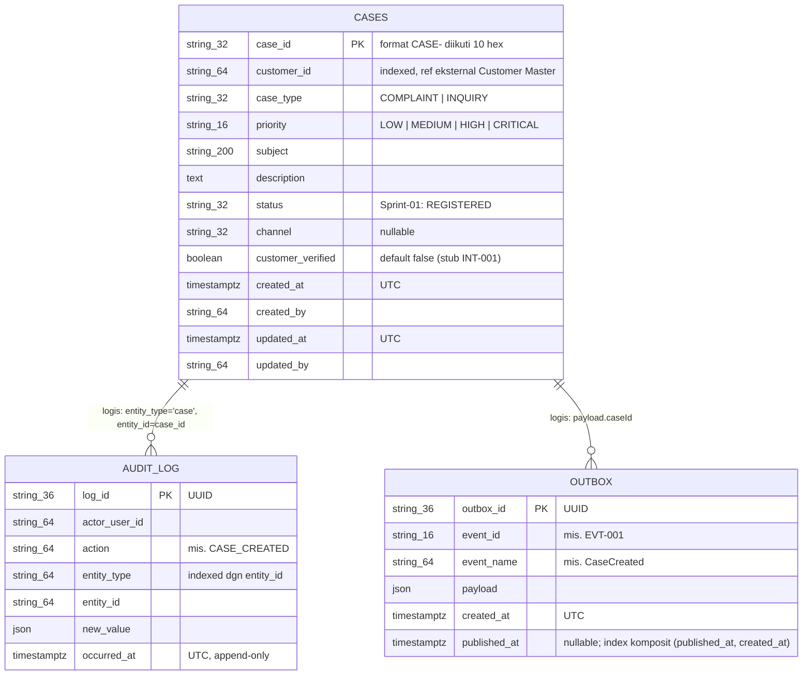
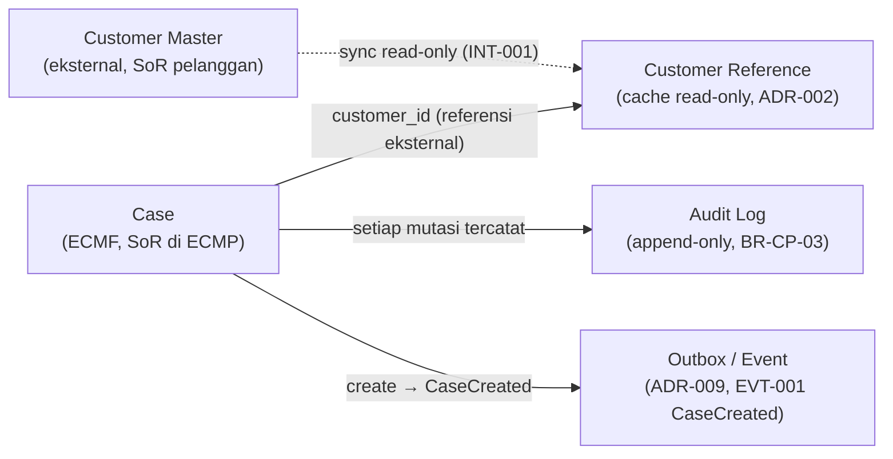
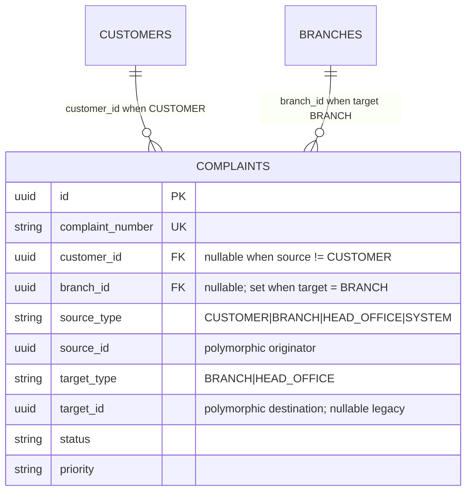
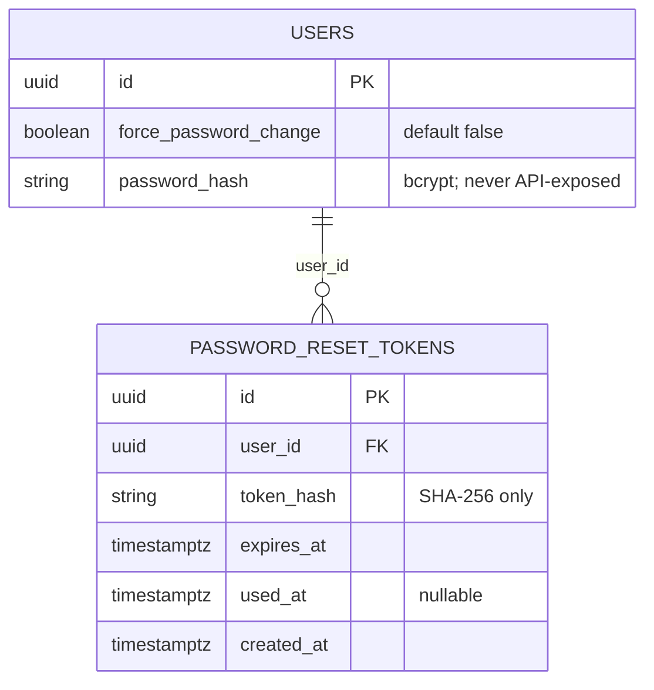

# ECMP ERD Sprint-01 (DD-ERD-001)

| Field | Value |
|---|---|
| ID | DD-ERD-001 |
| Version | 0.1 |
| Owner | Data Architect / BA Lead |
| Reviewer | Solution Architect, ECMF Domain PO |
| Approver | Architecture Board |
| Status | 🟢 Approved (baseline Sprint-01) |
| Last Review | 2026-07-21 |
| Next Review | 2027-01-21 |

## Purpose
Diagram relasi entitas untuk skema fisik Sprint-01 (migration `0001_initial_cases_audit_outbox`): tabel `cases`, `audit_log`, `outbox`, plus diagram konseptual relasi antar entitas inti. Definisi atribut lengkap ada di [`ECMP_Data_Dictionary_v1.0.md`](./ECMP_Data_Dictionary_v1.0.md).

## 1. ERD Fisik Sprint-01

Catatan: relasi antar tabel bersifat **logis** (tidak ada FK constraint fisik di Sprint-01). `audit_log` menunjuk entity via `entity_type` + `entity_id`; `outbox` memuat referensi case di dalam `payload`.

## 2. Diagram Konseptual Entitas Inti

Ringkasan relasi:
- **Case — Customer Reference (eksternal)**: Case memegang `customer_id` sebagai referensi ke Customer Master; ECMP bukan SoR pelanggan (ADR-002), verifikasi via INT-001 (stub Sprint-01 → `customer_verified=false`).
- **Case — Audit**: setiap mutasi Case menghasilkan entri `audit_log` (append-only) via `entity_type`/`entity_id`.
- **Case — Outbox/Event**: create Case menulis record `outbox` (EVT-001 CaseCreated) dalam satu transaksi; publikasi ke broker ditunda (ADR-009).

## Related
- `../06 Data Dictionary/ECMP_Data_Dictionary_v1.0.md`
- `../05 Architecture Decision Records/ECMP_ADR_002_ECMP_Not_System_Of_Record_v1.0.md`
- `../05 Architecture Decision Records/ECMP_ADR_009_Message_Broker_Deferral_v1.0.md`
- `../09 Integration Catalog/ECMP_INT_001_Customer_Master_Read_v0.1.md`
- `../27 Project Decisions/DEC-018_Multi_Source_Multi_Target_Complaint_TASK042_v1.0.md`
- `implementation/backend/alembic/versions/0001_initial_cases_audit_outbox.py` (skema fisik sumber)

## 3. Complaint multi-source / multi-target (DEC-018 / TASK-042)

Physical table `complaints` (backend migration `0026_complaint_source_target`)
adds polymorphic origin/destination without subtype tables:

Enums are VARCHAR-backed so future values (VENDOR, REGIONAL, …) do not require
schema changes. Lifecycle and related aggregates (Assignment, Timeline,
Resolution, Appointment, Escalation) are unchanged.

## Addendum — Identity & Password Management (2026-07-28)

Foundation Alembic `0037_password_management` (live SoT under `backend/`):

See `10 Security and Access Standards/ECMP_Identity_Password_Management_v1.0.md`.
