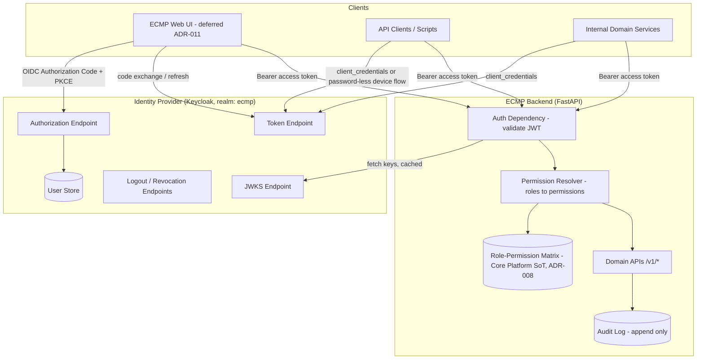
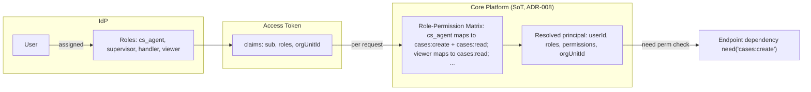
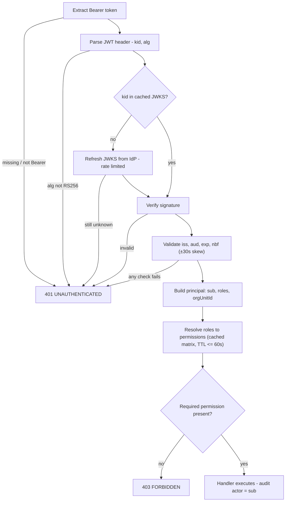
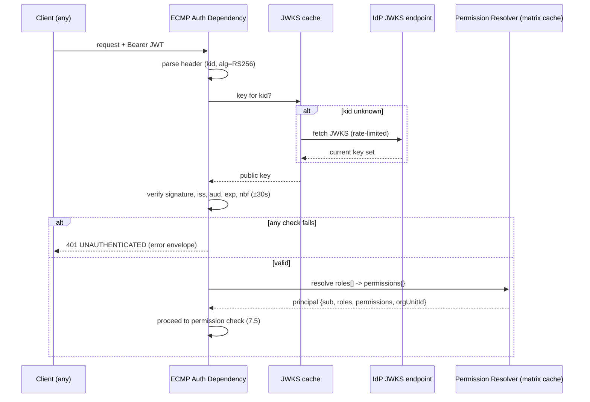
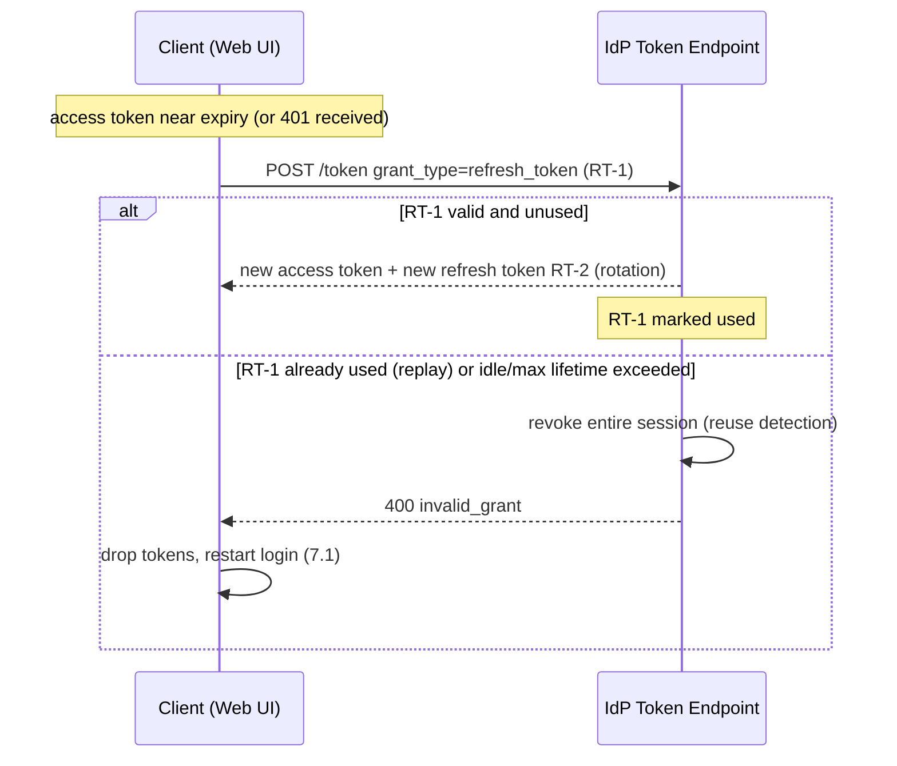
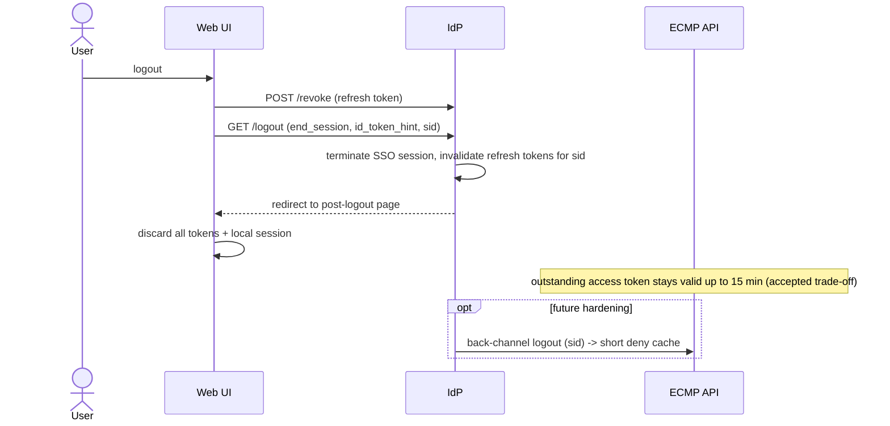
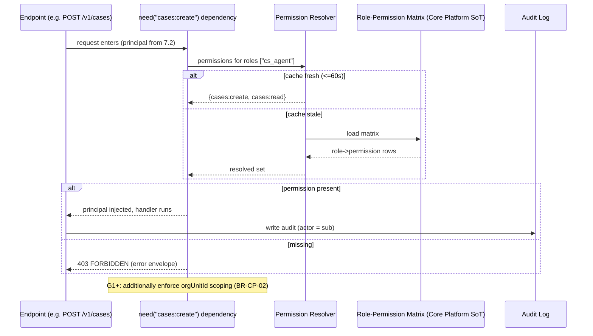
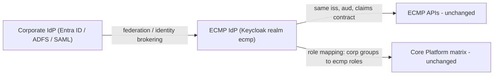

# ECMP Target Authentication Architecture v1.0

| Field | Value |
|---|---|
| ID | SEC-AUTH-001 |
| Version | 1.0 |
| Owner | Security Architect |
| Reviewer | Tech Lead / Solution Architect / Security Officer |
| Approver | Architecture Board |
| Status | 🟡 Proposed (design normative under Accepted ADR-012; implementation not authorized by this document) |
| Last Review | 2026-07-21 |
| Next Review | 2026-10-21 |

## Purpose

Normative design for the ADR-007 **target phase**: JWT/OIDC authentication that replaces static dev bearer tokens in every shared environment. Decision record: **ADR-012**. Migration/rollout: **SEC-MIG-001** (`ECMP_AuthN_Migration_Rollout_Plan_v1.0.md`).

**Scope boundary:** this is a design document. It authorizes no implementation; code changes follow the migration plan and normal sprint gating (DEC-002). The current dev-token mechanism (ADR-007 slice phase) is retained **for local DEV and CI only**.

## 1. Architecture Overview

Two authentication planes, selected per environment by a single mode switch:

| Mode | `ECMP_AUTH_MODE` | Environments | Mechanism |
|---|---|---|---|
| Dev (slice) | `dev` | Local DEV, CI only | Static env bearer tokens (`ECMP_DEV_TOKEN` family), fixed principals — unchanged from ADR-007 slice phase |
| Target | `jwt` | SIT, UAT, PROD (and optionally DEV) | OIDC IdP-issued RS256 JWT, validated per request |

Fail-safe rule: application **refuses to start** when `ECMP_AUTH_MODE=dev` and `ECMP_ENV` indicates a shared environment. Dev mode can never be reached by misconfiguration in SIT/UAT/PROD.



Trust boundaries: clients are untrusted; the IdP is the sole issuer of credentials; ECMP trusts only tokens whose signature chains to the IdP JWKS and whose `iss`/`aud` match configuration. ECMP never sees or stores passwords.

## 2. Identity Provider

### 2.1 Options (evaluated in ADR-012)

| Option | Fit | Verdict |
|---|---|---|
| **A. Keycloak (self-hosted OSS)** | Runs in ADR-010 compose-on-VM baseline; full OIDC + identity brokering; user store included | **Chosen baseline** |
| B. Managed IdP (Entra ID / Auth0 / Okta) | Best long-term SSO endpoint; needs procurement + internet-facing envs | Deferred — revisit at PROD platform trigger (ADR-010 §4) or corporate SSO mandate |
| C. Custom JWT issuer in Core Platform | No new component | Rejected — rebuilding an IdP is unjustified security risk |

Anti-lock-in rule: ECMP integrates only via **standard OIDC surfaces** — discovery (`/.well-known/openid-configuration`), JWKS, token, revocation, end-session. No Keycloak-proprietary API in application code. Swapping the IdP = new issuer URL + client re-registration.

### 2.2 Realm / client layout (baseline)

| Client | Type | Grant | Used by |
|---|---|---|---|
| `ecmp-web` | Public + PKCE | Authorization Code | Web UI (when frontend lands, ADR-011) |
| `ecmp-api-docs` | Public + PKCE | Authorization Code | Swagger UI / developer login |
| `ecmp-svc-<domain>` | Confidential | client_credentials | Internal service-to-service (one client per calling service) |
| `ecmp-ci` | Confidential | client_credentials | CI smoke tests against SIT |

## 3. Claims Design

Access token (RS256 JWT) — claims consumed by ECMP:

| Claim | Example | Source | ECMP usage |
|---|---|---|---|
| `iss` | `https://idp.ecmp.internal/realms/ecmp` | IdP | Must equal configured issuer |
| `aud` | `ecmp-api` | IdP client scope | Must contain configured audience |
| `sub` | `4f8a...` (stable IdP user id) | IdP | Principal identity; audit `actor` |
| `preferred_username` | `d.pratama` | User store | Display / logging (non-PII policy per SEC-STD §4 applies) |
| `exp` / `iat` / `nbf` | epoch | IdP | Lifetime enforcement |
| `sid` | session id | IdP | Correlate logout / back-channel events |
| `roles` | `["cs_agent"]` | IdP role mapping | **Input to RBAC resolution** (see §4) |
| `orgUnitId` | `OU-JKT-01` | User attribute in IdP | BR-CP-02 org-unit scoping (closes L-3 path at G1) |
| `azp` / `client_id` | `ecmp-svc-kpi` | IdP | Distinguish service principals (§8) |

Rules:
- **Permissions are never claims.** Tokens carry roles; Core Platform resolves permissions (rationale in §4).
- ID token is used only by the front-end session; APIs accept **access tokens only**.
- No customer PII in tokens. `preferred_username` is an internal staff identifier.
- Unknown extra claims are ignored (forward compatibility with corporate IdP claims).

Service tokens (client_credentials) carry `azp`/`client_id` and `roles` for the service account, no `orgUnitId` (see §8).

## 4. Roles, Permissions, and RBAC-in-JWT Integration

Role and permission **definitions do not change**: SoT remains the Core Platform Role-Permission matrix (`ECMP_Role_Access_Matrix_v0.1.md`, ADR-008). What changes is where each piece lives at runtime:



Division of responsibility:

| Concern | Owner | Rationale |
|---|---|---|
| User ↔ Role assignment | IdP (administered per BR-ADM-01 approval process) | Identity lifecycle lives with identity |
| Role ↔ Permission mapping | Core Platform matrix (ADR-008) | Single SoT; Administration remains configurator only |
| Permission enforcement | Core Platform auth dependency (`need(perm)` pattern, unchanged) | Structural enforcement stays identical to slice phase |
| Org-unit scoping | `orgUnitId` claim + Core Platform checks (BR-CP-02) | Enabled at gate G1 per limitation L-3 |

Why roles-in-token, permissions-resolved:
1. **Freshness** — revoking a permission from a role takes effect within the resolver cache TTL (≤60 s), not at token expiry.
2. **SoT integrity** — embedding permissions would copy the matrix into the IdP, creating the dual-ownership problem ADR-008 resolved.
3. **Token size/stability** — role list is short and stable; permission lists grow per sprint.

Resolver contract: `roles[] → permissions{}` lookup against the matrix, cached in-process with ≤60 s TTL; unknown role → resolves to empty set (fail-closed) and logged. Resulting principal shape stays `{userId, roles, permissions, orgUnitId}` — a superset of today's slice principal, so endpoint code (`need("cases:create")`) is unchanged.

## 5. Token Lifetimes

| Token | Lifetime | Notes |
|---|---|---|
| Access token | **15 min** | Short enough to bound logout/role-change lag; long enough to avoid refresh storms |
| Refresh token | **8 h idle, 12 h max session**, single-use (rotation) | Covers a shift + overtime; reuse of a rotated token revokes the session (theft detection) |
| ID token | 15 min | Front-end session bootstrap only |
| Service token (client_credentials) | 15 min, **no refresh token** | Services re-request with credentials |

Clock skew tolerance: ±30 s on `exp`/`nbf`. All timestamps UTC (consistent with audit standard FR-001c).

## 6. API Authentication (every request)

All `/v1/*` endpoints require `Authorization: Bearer <access-token>`. Unauthenticated surface stays exactly `/health` (SEC-STD §1). OpenAPI `securitySchemes.bearerAuth (bearerFormat: JWT)` becomes literally accurate (closing the ADR-007 context note).

Validation pipeline (per request, in the auth dependency — same structural position as today's `require_user`):



Operational properties:
- JWKS cached in-process (TTL ~10 min) + refreshed on unknown `kid` → key rotation needs no deploy; IdP outage does not break validation of already-cached keys within TTL.
- No token introspection call per request (offline validation) → IdP is not on the request hot path; NFR latency budget unaffected except the local permission lookup.
- 401/403 semantics and error envelope unchanged from ADR-007 §4.

## 7. Sequences

### 7.1 Login (OIDC Authorization Code + PKCE)

```mermaid
sequenceDiagram
  actor User
  participant FE as Web UI (SPA/BFF)
  participant IdP as IdP (Keycloak)
  participant API as ECMP API

  User->>FE: open ECMP
  FE->>FE: generate PKCE code_verifier + challenge, state, nonce
  FE->>IdP: GET /authorize?client_id=ecmp-web&response_type=code&code_challenge&state&nonce&scope=openid
  IdP->>User: login page (credentials, MFA if policy)
  User->>IdP: authenticate
  IdP-->>FE: redirect with authorization code + state
  FE->>FE: verify state matches
  FE->>IdP: POST /token (code + code_verifier)
  IdP-->>FE: access token (15m) + refresh token (rotating) + ID token
  FE->>FE: verify ID token nonce; establish session; store tokens (memory / httpOnly via BFF)
  FE->>API: GET /v1/... with Authorization: Bearer access-token
  API-->>FE: 200 (validated per §6)
```

Notes: PKCE is mandatory (public client); `state` blocks CSRF on the redirect, `nonce` blocks ID-token replay. Whether tokens live in a BFF session cookie or SPA memory is decided with the frontend stack (ADR-011 follow-up) — both fit this flow.

### 7.2 Token Validation (per API request)



### 7.3 Refresh



Rules: refresh happens proactively (~2 min before `exp`) or reactively on 401; ECMP APIs are never involved in refresh. Rotation + reuse detection means a stolen refresh token is invalidated the moment either party uses the stale copy.

### 7.4 Logout



Strategy: logout = revoke refresh token + end IdP session + client-side token disposal. Baseline explicitly accepts up to 15 min residual access-token validity instead of building a per-request denylist (which would put the IdP/state store on the hot path). Back-channel logout (`sid`-keyed deny cache) is the documented hardening step if compliance later requires immediate revocation — API contract already carries `sid` so this is additive.

### 7.5 Permission Check



The `need(perm)` structural pattern (a route cannot forget the check) is preserved exactly; only the principal construction upstream changes.

## 8. Service-to-Service Authentication

Applies when domains split into separate services (post ADR-009 broker decision); designed now so the split needs no auth rework.

- Grant: **OAuth2 client_credentials** per calling service (`ecmp-svc-<domain>` confidential clients). Secrets live in the environment secret store (DEP-001 §2 / vault at SIT/UAT activation, never in repo — SEC-STD §7).
- Service tokens: 15 min, no refresh; callers re-request on expiry. Identified by `azp`; service accounts get **narrow service roles** (e.g. `svc_kpi_reader`) mapped in the same Core Platform matrix — no "internal traffic bypasses authz" path.
- Receiving side validates service tokens through the identical §6 pipeline — one code path for humans and services.
- Async/event paths (outbox → future broker): producer identity is the writing service's DB/broker credential; event **payload** carries `actor` from the originating user token for audit lineage, per Event Catalog schema — events do not carry tokens.
- mTLS between services is a deployment-layer option at PROD platform decision time (ADR-010 §4); not required by this design.

## 9. Future SSO Support

Blueprint lists SSO as Future Enhancement. This design makes it a **brokering configuration**, not a rebuild:



Path A (default): Keycloak brokers the corporate IdP — users authenticate upstream, Keycloak maps corporate groups → ECMP roles, tokens keep the same `iss`/`aud`/claims; **zero application change**.
Path B: replace Keycloak entirely with the corporate IdP — possible because ECMP touches only standard OIDC surfaces (§2.1); migration = issuer/JWKS/client config + claim-mapping verification.
Design guardrails that keep both paths open: no proprietary IdP API usage, claims contract documented here (§3), roles-not-permissions in tokens (§4).

## 10. Environment Matrix

| Environment | Mode | IdP | Notes |
|---|---|---|---|
| Local DEV | `dev` (default) or `jwt` (optional compose profile with local Keycloak) | none / local container | Offline-friendly; dev tokens unchanged |
| CI | `dev` | none | Deterministic tests keep dev principals; add JWT-mode contract tests in Phase 2 (SEC-MIG-001) |
| SIT / UAT | `jwt` **only** | Keycloak container in ADR-010 compose baseline | Activation gate of ADR-010 §3 satisfied by this phase |
| PROD | `jwt` **only** | Decided with PROD platform ADR (ADR-010 §4 trigger) — Keycloak hardened or managed IdP | Startup guard rejects `dev` mode |

## Related
- ADR-012 (decision), ADR-007 (slice phase, remains valid), ADR-008 (RBAC SoT), ADR-010 (deployment baseline), ADR-011 (frontend deferral)
- `ECMP_AuthN_Migration_Rollout_Plan_v1.0.md` (SEC-MIG-001) — migration, risks, rollout
- `ECMP_Role_Access_Matrix_v0.1.md`, `ECMP_AuthN_Limitations_Register_v0.1.md`, `ECMP_Security_Standards_v0.1.md`, `ECMP_Threat_Model_v0.1.md`
- `07 API Catalog` (bearerAuth scheme), `14 Deployment Standards` (DEP-001)
