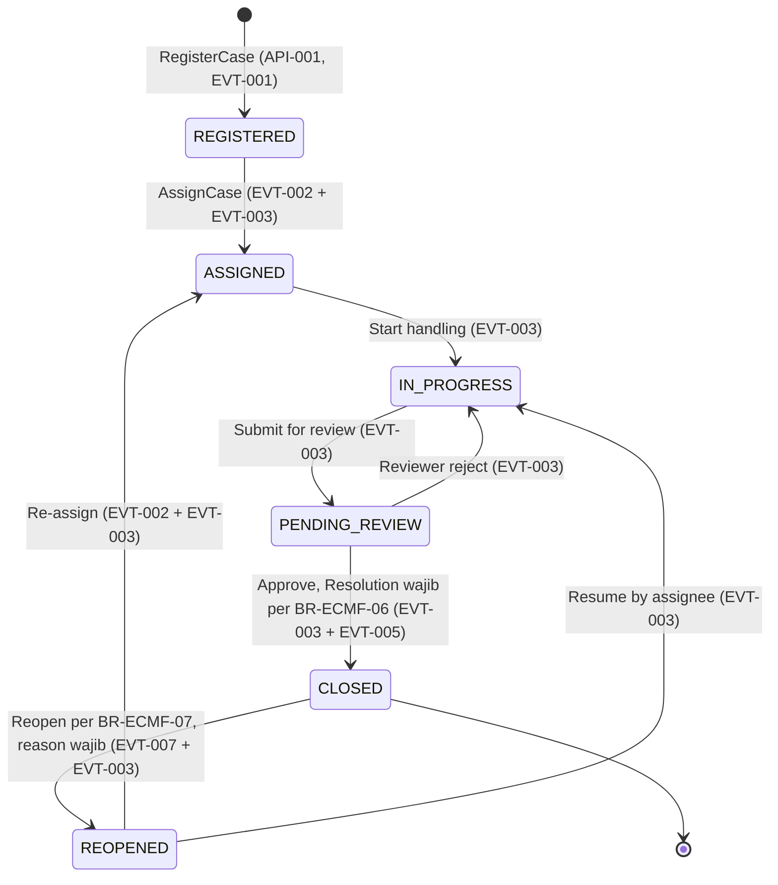

# ECMF — Case State Machine

| Field | Value |
|---|---|
| ID | DOM-ECMF-003 |
| Version | 1.1 |
| Owner | ECMF PO / Solution Architect |
| Reviewer | Tech Leads / Administrator |
| Approver | Architecture Board |
| Status | 🟢 Approved (baseline) |
| Last Review | 2026-07-21 |
| Next Review | 2027-01-21 |

## Objective
Mendefinisikan **baseline** state machine Case: enum status, matriks transisi awal, guard per transisi, dan pemetaan event. Ini adalah konfigurasi awal — bukan hardcode.

## Posisi Governance (penting)
1. **Definisi transisi = Workflow Config milik Administration (ADR-008).** Tabel di dokumen ini adalah **baseline konfigurasi awal** yang akan dimuat ke Workflow Config — bukan aturan hardcoded di ECMF. Perubahan matriks dilakukan via Administration (approval BR-ADM-01, versioning BR-ADM-03, publish EVT-006), dan ECMF me-reload config aktif. ECMF = enforcer: menolak transisi yang tidak ada di config aktif (BR-001 / BR-ECMF-03).
2. **Sprint-01 hanya mengimplementasikan status `REGISTERED`** (FR-001a). Enforcement transisi penuh adalah desain **gate G1** — belum ada endpoint transisi di Sprint-01.
3. Setiap transisi tervalidasi menghasilkan event (mapping di bawah) + audit record (BR-008).

## Status Enum (baseline)
> Tabel ini adalah **Source of Truth (SoT) untuk nilai enum Case status** — dokumen lain (mis. `06 Data Dictionary`) merujuk ke sini.

| Status | Deskripsi |
|---|---|
| `REGISTERED` | Case tercatat, belum di-assign (status awal, FR-001a) — **satu-satunya status di Sprint-01** |
| `ASSIGNED` | Sudah ditetapkan ke assignee/unit |
| `IN_PROGRESS` | Sedang ditangani |
| `PENDING_REVIEW` | Menunggu review/approval hasil penanganan |
| `CLOSED` | Selesai dengan Resolution (BR-ECMF-06) |
| `REOPENED` | Dibuka kembali setelah closed (BR-ECMF-07) |

## Matriks Transisi (baseline Workflow Config)
| From | To | Guard | Event |
|---|---|---|---|
| `REGISTERED` | `ASSIGNED` | Role dengan permission assign (mis. supervisor/dispatcher unit terkait, BR-ECMF-02); assigneeId/unitId valid | EVT-002 CaseAssigned + EVT-003 StatusChanged |
| `ASSIGNED` | `IN_PROGRESS` | Hanya assignee (atau supervisor unit terkait) | EVT-003 StatusChanged |
| `IN_PROGRESS` | `PENDING_REVIEW` | Assignee; hasil penanganan terisi | EVT-003 StatusChanged |
| `PENDING_REVIEW` | `CLOSED` | Reviewer/supervisor; **Resolution wajib**, evidence sesuai kategori bila dipersyaratkan (BR-ECMF-06) | EVT-003 StatusChanged + EVT-005 CaseClosed |
| `PENDING_REVIEW` | `IN_PROGRESS` | Reviewer menolak — kembali diproses; alasan penolakan dicatat di activity log (BR-ECMF-04) | EVT-003 StatusChanged |
| `CLOSED` | `REOPENED` | Hanya role yang diizinkan, dalam **30 hari kalender** sejak closure (BR-ECMF-07, baseline per DEC-004); **reason wajib** | EVT-007 CaseReopened (Proposed) + EVT-003 StatusChanged |
| `REOPENED` | `ASSIGNED` | Re-assignment ke assignee/unit (guard sama dengan REGISTERED→ASSIGNED) | EVT-002 CaseAssigned + EVT-003 StatusChanged |
| `REOPENED` | `IN_PROGRESS` | Assignee lama melanjutkan langsung | EVT-003 StatusChanged |

### Guard umum (berlaku semua transisi)
- AuthN + AuthZ via Core Platform (BR-007); hak akses mengikuti peran organisasi (BR-ECMF-02).
- **Override oleh Administrator** di luar matriks hanya diizinkan dengan justifikasi tercatat — field `reason` pada EVT-003 **mandatory untuk override** (exception BR-ECMF-03; payload events.yaml).
- Audit record immutable per transisi dalam transaksi yang sama (BR-008).
- Transisi memicu evaluasi ulang SLA Clock (BR-005): reopen me-restart clock (consumer KPI, EVT-007).

## Event Mapping
| Event | Dipicu oleh |
|---|---|
| EVT-002 CaseAssigned | Setiap assignment/reassignment (REGISTERED→ASSIGNED, REOPENED→ASSIGNED) |
| EVT-003 StatusChanged | **Setiap** transisi status valid (BR-001), termasuk yang juga memicu event spesifik |
| EVT-005 CaseClosed | PENDING_REVIEW→CLOSED |
| EVT-007 CaseReopened | CLOSED→REOPENED (status katalog: Proposed) |

## State Diagram

Diagram source: `../../23 Assets/mermaid/case-state-machine.mmd`

## Related
- `README.md` (DOM-ECMF-001), `CASE_AGGREGATE.md` (DOM-ECMF-002)
- `../Administration/README.md` (DOM-ADM-001) — SoT Workflow Config
- `../../05 Architecture Decision Records/ECMP_ADR_008_RBAC_SoT_Workflow_Ownership_v1.0.md`
- `../../08 Event Catalog/events/events.yaml` — SoT event

## Open Questions
- ~~Jangka waktu maksimum reopen (BR-ECMF-07)~~ — **ditutup**: 30 hari kalender (baseline per `27 Project Decisions/DEC-004_BR_Baseline_Defaults_v1.0.md`; dapat direvisi BO via DEC baru).
- Apakah REGISTERED→CLOSED langsung (mis. duplicate/invalid case) perlu ada di baseline? Belum — tunggu kebutuhan bisnis, ubah via Workflow Config bukan kode.
