# Knowledge Graph (Generated)

| Field | Value |
|---|---|
| ID | AI-KG-GEN-001 |
| Version | 0.1 |
| Owner | Automation |
| Reviewer | PMO / Enterprise Architecture |
| Approver | Architecture Board |
| Status | 🟡 Draft |
| Last Review | auto |
| Next Review | auto |

> Enriched from ontology + traceability + OpenAPI + FRD + ADR.

- Ontology: `ai/ontology/ontology.yaml`
- Nodes: 74
- Edges: 135

Machine source: `ai/knowledge-graph/graph.generated.yaml`

```mermaid
flowchart TD
  Core_Platform[Core Platform] --> FR-001c[FR-001c]
  FR-001c --> API-001[API-001]
  FR-001c --> TC-005[TC-005]
  ECMF[ECMF] --> FR-001[FR-001]
  FR-001 --> API-001[API-001]
  FR-001 --> EVT-001[EVT-001]
  FR-001 --> TC-001[TC-001]
  ECMF[ECMF] --> FR-002[FR-002]
  FR-002 --> API-002[API-002]
  FR-002 --> TC-002[TC-002]
  ECMF[ECMF] --> FR-003[FR-003]
  FR-003 --> API-003[API-003]
  FR-003 --> EVT-002[EVT-002]
  FR-003 --> EVT-003[EVT-003]
  FR-003 --> TC-003[TC-003]
  ECMF[ECMF] --> FR-004[FR-004]
  FR-004 --> API-004[API-004]
  FR-004 --> EVT-003[EVT-003]
  FR-004 --> TC-004[TC-004]
  CRM[CRM] --> FR-010[FR-010]
  FR-010 --> API-010[API-010]
  FR-010 --> TC-010[TC-010]
  Notification[Notification] --> FR-020[FR-020]
  FR-020 --> EVT-001[EVT-001]
  FR-020 --> EVT-002[EVT-002]
  FR-020 --> TC-020[TC-020]
  KPI[KPI] --> FR-030[FR-030]
  FR-030 --> EVT-004[EVT-004]
  FR-030 --> EVT-001[EVT-001]
  FR-030 --> EVT-003[EVT-003]
  FR-030 --> EVT-005[EVT-005]
  FR-030 --> EVT-007[EVT-007]
  FR-030 --> TC-030[TC-030]
```

## Query tips

- Impact: `python tools/eos.py impact --id BR-001`
- Semantic search: `python tools/eos.py rag --query "create case"`
- Orchestrate: `python tools/eos.py orchestrate --task "implement FR-001"`
