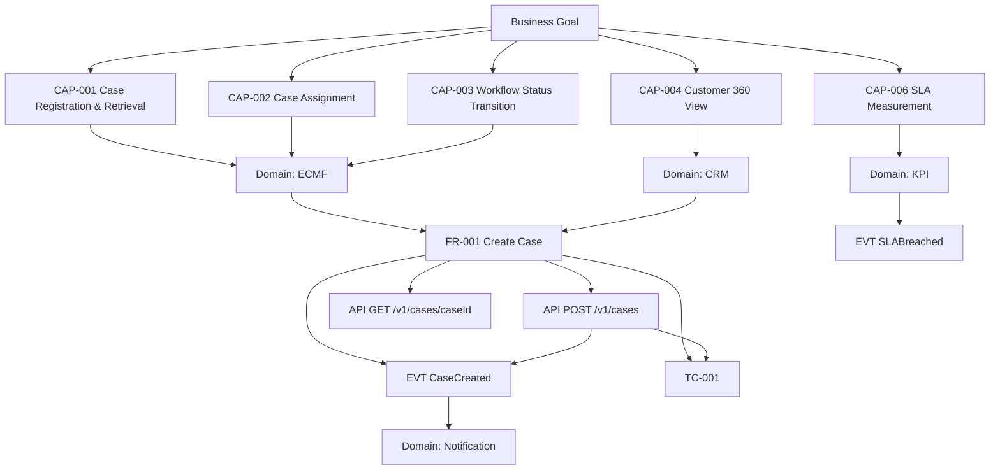

# ECMP Knowledge Graph (View)

> **DEPRECATED** — snapshot manual; superseded oleh `graph.generated.md` / `graph.generated.yaml`
> (di-generate `tools/generate_knowledge_graph.py`; file manual ini bukan input generator).

| Field | Value |
|---|---|
| ID | AI-KG-002 |
| Version | 0.2 |
| Owner | Enterprise Architecture |
| Reviewer | BA / Architect |
| Approver | Architecture Board |
| Status | 🔴 Deprecated |
| Last Review | 2026-07-21 |
| Next Review | 2026-10-21 |

Source machine graph: `graph.yaml` (deprecated — lihat banner di atas)

CAP-0xx mengikuti `01 Business Blueprint/ECMP_Capability_Register_v0.1.md` (BP-CAP-001).

## Impact Analysis Example
Changing `POST /v1/cases` impacts: FR-001, EVT-001, Notification consumers, TC-001, and potentially CRM linkage assumptions.
