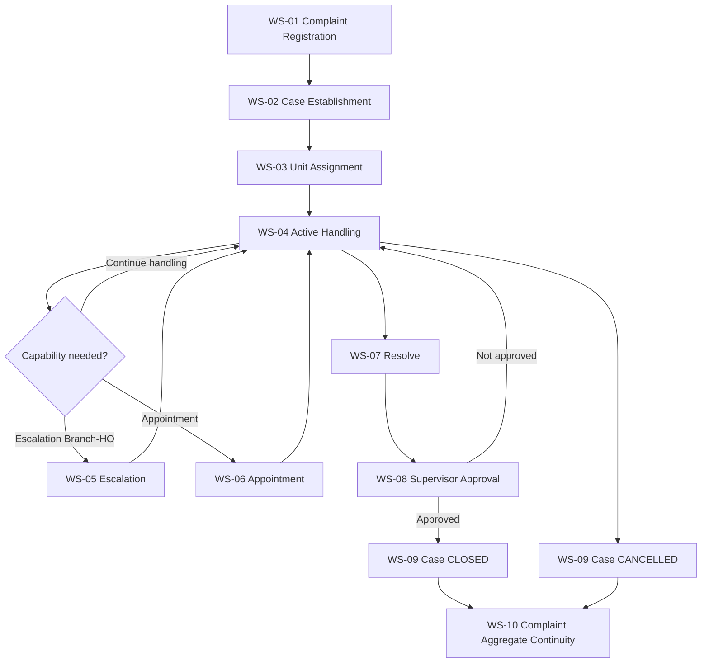
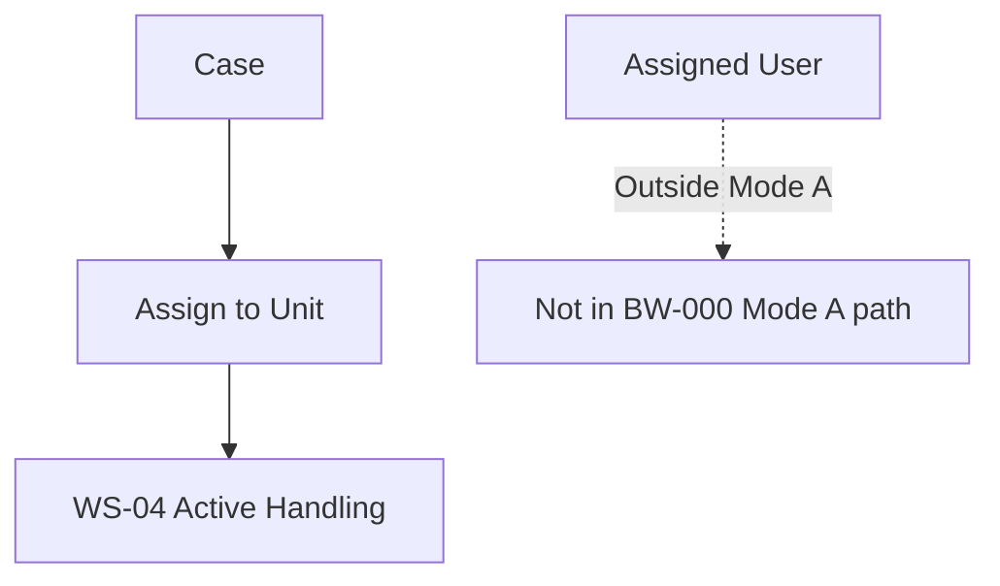
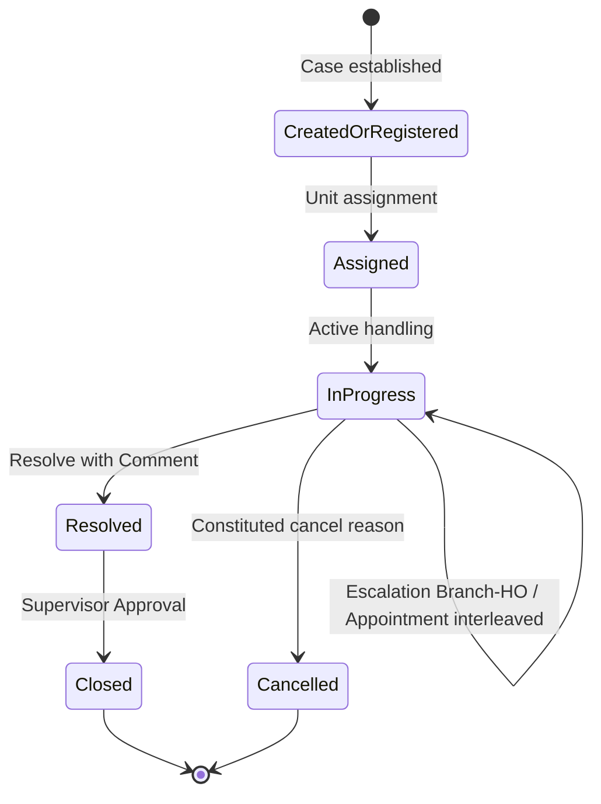
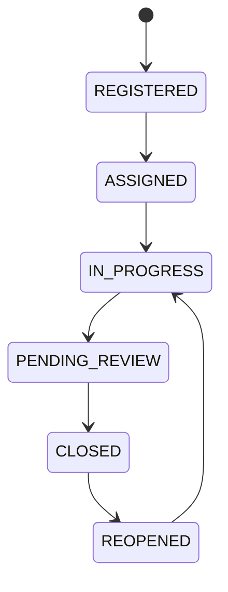

# BW-000 — Business Workflow Constitution

| Field | Value |
|---|---|
| Document ID | BW-000 |
| Title | ECMP Business Workflow Constitution — Mode A Baseline |
| Version | 1.0 |
| Date | 2026-08-05 |
| Status | **NORMATIVE WORKFLOW — Mode A Baseline** |
| Milestone | Governance Phase 1 |
| Authority | Derived from **BC-000** and **BC-001** only (secondary: DL-000, GC-000 via those documents) |
| Subordination | Board → ADR → EA → ECMP-CONSTITUTION-001 → BC-000 → BC-001 → **BW-000** → Business Rules / Domain / UX / Architecture / Implementation |
| Applicability | **Mode A only** |
| Does not | Describe screens, UI, APIs, databases, or code · invent business decisions · unlock Mode B · contradict BC-000 |

---

# 1 Purpose

BW-000 defines the **canonical business workflow** of the ECMP Complaint Management Module under Mode A.

It tells Business Analysts and other readers **how complaint work moves** through constituted stages, gates, assignment, escalation, SLA touchpoints, and closure.

| This document SHALL | This document SHALL NOT |
|---|---|
| Describe business flow and business states | Describe screens, wireframes, or navigation |
| Cite BC-000 / BC-001 for every stage | Invent new lifecycle states or obligations |
| Separate Complaint Aggregate outcomes from Case outcomes | Prescribe APIs, tables, or source code |

If BW-000 appears to conflict with BC-000, **BC-000 SHALL prevail**.

---

# 2 Workflow Philosophy

Derived from BC-001 and BC-000:

| Philosophy | Meaning for workflow | Principles |
|---|---|---|
| Single Complaint Lifecycle | Escalation and Appointment are stages/capabilities **inside** one lifecycle, not parallel products | BP-005 |
| Timeline First | Business-significant changes, including SLA changes, produce Timeline memory | BP-006 |
| Explicit Duality | Two Case state definitions coexist; Mode A delivery path is stated explicitly without silent merge | BP-011 |
| Controlled Escalation | Only Branch ↔ Head Office | BP-008 |
| Case ≠ Complaint closure | Closing a Case does not close the Complaint Aggregate | BP-014 |
| Scope Discipline | OOS capabilities are absent from this workflow | BP-013 |
| Honest Persona Capability | Actors are named; Manager Workspace delivery is not assumed | BP-012 |
| Business Before Technology | Workflow states are business meaning, not technical namespace tricks | BP-001 |

**Mode A exposure note (BC-9.5):** Aggregate states `PENDING` / `ESCALATED` remain **defined** but SHALL NOT be exposed on the Mode A delivery surface. Escalation remains an official capability; workflow text below describes business intent without requiring those state labels on Mode A surfaces.

---

# 3 Canonical Complaint Lifecycle

## 3.1 Lifecycle Table (Mode A — business view)

| Order | Stage ID | Stage Name | Primary object | Notes |
|---|---|---|---|---|
| 1 | WS-01 | Complaint Registration | Complaint | May exist without Case |
| 2 | WS-02 | Case Establishment | Case under Complaint | Mandatory within 1 working day after Complaint `REGISTERED` |
| 3 | WS-03 | Unit Assignment | Case | Unit level only |
| 4 | WS-04 | Active Handling | Case | In-progress work |
| 5 | WS-05 | Escalation (Branch ↔ Head Office) | Case / Complaint lifecycle | Official; Mode A surface does not expose PENDING/ESCALATED labels |
| 6 | WS-06 | Appointment (same lifecycle) | Appointment within Complaint lifecycle | Not a separate lifecycle |
| 7 | WS-07 | Resolve | Case | Comment required |
| 8 | WS-08 | Supervisor Approval for Closure | Case | Gate before Case `CLOSED` |
| 9 | WS-09 | Case Closure or Cancellation | Case | Does not auto-close Complaint |
| — | WS-10 | Complaint Aggregate Continuity | Complaint | Remains open/closed by separate rules; multi-Case allowed |

Stages WS-05 and WS-06 MAY interleave with WS-04 when constituted capabilities apply; they do not create a second product lifecycle (BC-5.8, BC-5.9).

## 3.2 Dual Case State Definitions (coexistence)

BC-000 requires both definitions to remain explicit (BC-9.1). BW-000 uses them as follows:

| Definition | Sequence (as constituted) | Use in this workflow |
|---|---|---|
| **Definition A** (DOM-ECMF-003) | `REGISTERED → ASSIGNED → IN_PROGRESS → PENDING_REVIEW → CLOSED → REOPENED` | Declared SoT A — SHALL NOT silently overwrite Definition B |
| **Definition B** (BR-CM-CAT) | `CREATED → ASSIGNED → IN_PROGRESS → PENDING/ESCALATED → RESOLVED → CLOSED` (+ `CANCELLED` before final resolution) | Declared SoT B — Mode A resolve/close path aligns with `IN_PROGRESS → RESOLVED →` Supervisor Approval `→ CLOSED` (BC-8.3) |

**Mode A canonical handling path (business):** after Case is in active handling → Resolve with Comment → Supervisor Approval → Case Closed; Cancellation is an alternate terminal for Case under constituted reasons.

---

# 4 Workflow Stages

---

## WS-01 — Complaint Registration

| Field | Content |
|---|---|
| **Stage ID** | WS-01 |
| **Purpose** | Establish the Complaint Aggregate as the business container for subsequent Case work. |
| **Entry Criteria** | A constituted source initiates a Complaint: at least `CUSTOMER`, `BRANCH`, `HEAD_OFFICE`, or `SYSTEM` (BC-9.3). Target MAY be `BRANCH` or `HEAD_OFFICE` (BC-7.2). |
| **Exit Criteria** | Complaint is registered. A Case MAY be absent at this moment (BC-9.2). |
| **Allowed Decisions** | Register Complaint without Case; record source/target types within the single aggregate model. |
| **Produced Events** | Business-significant registration SHALL be subject to mandatory write-audit (BC-5.7). Timeline memory applies to significant changes per Timeline Constitution. |
| **Affected Principles** | BP-005; BP-003; BP-009; BP-006 |
| **Referenced Constitution Clauses** | BC-9.2; BC-9.3; BC-5.4; BC-4.1; BC-7.2; BC-5.7 |
| **Referenced Decisions** | DL-024; DL-006; DL-063 |

---

## WS-02 — Case Establishment

| Field | Content |
|---|---|
| **Stage ID** | WS-02 |
| **Purpose** | Ensure every Complaint obtains Case work capacity under Mode A rules. |
| **Entry Criteria** | Complaint exists; Case not yet meeting the mandatory minimum, or additional Case is required within the default maximum. |
| **Exit Criteria** | At least one Case exists within **one working day** after Complaint `REGISTERED` (BC-5.4). Case Number is independent and uses `CASE-YYYY-NNNNNN` (BC-9.9). Each Case binds an SLA Policy Version (**bind-without-clock** in Mode A) (BC-9.10). Default maximum **five** Cases per Complaint (BC-9.4). |
| **Allowed Decisions** | Create Case; bind SLA Policy Version; surface threshold breaches to Supervisor Queue (BC-5.4). |
| **Produced Events** | SLA binding / SLA-related changes SHALL be recorded as Timeline Event(s) (BC-5.3; BC-6.1). Write-audit on governed writes (BC-5.7). |
| **Affected Principles** | BP-010; BP-006; BP-005; BP-014 |
| **Referenced Constitution Clauses** | BC-5.4; BC-9.2; BC-9.4; BC-9.9; BC-9.10; BC-4.9 |
| **Referenced Decisions** | DL-024; DL-067 |

---

## WS-03 — Unit Assignment

| Field | Content |
|---|---|
| **Stage ID** | WS-03 |
| **Purpose** | Place Case work with a responsible Unit. |
| **Entry Criteria** | Case exists and requires assignment. |
| **Exit Criteria** | Case is assigned at **Unit** level (BC-4.7; BC-9.4). |
| **Allowed Decisions** | Assign to Unit. Individual Assigned User assignment SHALL NOT be treated as Mode A workflow (outside Mode A). Supervisor retains R/A for assignment authority patterns (BC-8.2; BC-8.3). Complaint Officer assign capability only if Authorization permits. |
| **Produced Events** | Assignment as business-significant change SHALL be auditable (write-audit). Timeline Event(s) when constituted as significant for the lifecycle. |
| **Affected Principles** | BP-012; BP-003; BP-005 |
| **Referenced Constitution Clauses** | BC-4.7; BC-9.4; BC-8.2; BC-8.3 |
| **Referenced Decisions** | DL-024; DL-001 |

---

## WS-04 — Active Handling

| Field | Content |
|---|---|
| **Stage ID** | WS-04 |
| **Purpose** | Perform complaint/case work toward resolution under the applicable state definition. |
| **Entry Criteria** | Case is assigned and in active handling (business: in progress). |
| **Exit Criteria** | Case is ready for Resolve, Cancellation, or interleaving Escalation/Appointment capabilities; or returns from those capabilities to continue handling. |
| **Allowed Decisions** | Progress work; request Escalation (WS-05); perform Appointment steps when applicable (WS-06); prepare Resolve; initiate Cancel with constituted reason. |
| **Produced Events** | Significant progress changes as Timeline/audit obligations require; SLA-related changes always as Timeline Events. |
| **Affected Principles** | BP-001; BP-015; BP-006; BP-005 |
| **Referenced Constitution Clauses** | BC-9.1; BC-8.2; BC-5.10; BC-6.1 |
| **Referenced Decisions** | DL-023; DL-001; DL-027; DL-067 |

---

## WS-05 — Escalation (Branch ↔ Head Office)

| Field | Content |
|---|---|
| **Stage ID** | WS-05 |
| **Purpose** | Move work along the constituted escalation path inside the same Complaint Lifecycle. |
| **Entry Criteria** | Business need to escalate under Mode A; path limited to **Branch → Head Office** (and return along that path as later approved escalation decisions allow) (BC-7.1). |
| **Exit Criteria** | Escalation capability applied within Branch ↔ Head Office; work continues in the same lifecycle (typically returning to handling/resolve path). Regional Office SHALL NOT be a node (BC-7.1). |
| **Allowed Decisions** | Escalate Branch → Head Office; continue lifecycle. Detailed visibility/return/result-audience rules from DEC-F4 SHALL NOT be treated as workflow-force until formal DEC completion (BC-7.3). |
| **Produced Events** | Escalation-related business-significant changes subject to write-audit and Timeline obligations where SLA/lifecycle significance applies. |
| **Affected Principles** | BP-008; BP-009; BP-005; BP-013 |
| **Referenced Constitution Clauses** | BC-5.9; BC-4.8; BC-7.1; BC-7.3; BC-9.5 |
| **Referenced Decisions** | DL-066 |

---

## WS-06 — Appointment (Same Lifecycle)

| Field | Content |
|---|---|
| **Stage ID** | WS-06 |
| **Purpose** | Execute constituted Appointment capabilities as part of the Complaint Lifecycle (not a separate lifecycle). |
| **Entry Criteria** | Appointment is applicable under approved bounds (booking upon approved escalation context as constituted by DEC-007…011 chain / DL-066). |
| **Exit Criteria** | One of the constituted Appointment outcomes is reached: booked; checked in; completed / partially completed; or no-show — within authorized bounds. Calendar/Slot/Work Order remain OOS. |
| **Allowed Decisions** | Book; check in; complete (`COMPLETED` \| `PARTIALLY_COMPLETED`); mark no-show; related Final Resolution bounds as constituted (one Final Resolution per complaint after completion; does not itself close Complaint/Escalation). |
| **Produced Events** | Appointment and related Final Resolution business facts SHALL be reflected through Timeline/audit obligations for significant changes; SLA-related impacts as Timeline Events. |
| **Affected Principles** | BP-005; BP-006; BP-013 |
| **Referenced Constitution Clauses** | BC-5.8; BC-9.6; §11 |
| **Referenced Decisions** | DL-066; DL-007; DL-008; DL-009; DL-010; DL-011 |

---

## WS-07 — Resolve

| Field | Content |
|---|---|
| **Stage ID** | WS-07 |
| **Purpose** | Record resolution of the Case under Mode A rules. |
| **Entry Criteria** | Case is in active handling and ready to resolve. |
| **Exit Criteria** | Case reaches resolved business state with **mandatory Comment**; Attachment MAY be optional; Complaint Attachments MAY be reused (BC-9.7). |
| **Allowed Decisions** | Resolve with Comment; optionally attach evidence. |
| **Produced Events** | Resolution as business-significant change (write-audit); SLA-related changes as Timeline Events. |
| **Affected Principles** | BP-006; BP-007; BP-012 |
| **Referenced Constitution Clauses** | BC-9.7; BC-8.3; BC-5.3 |
| **Referenced Decisions** | DL-024; DL-067 |

---

## WS-08 — Supervisor Approval for Closure

| Field | Content |
|---|---|
| **Stage ID** | WS-08 |
| **Purpose** | Gate Case closure through Supervisor authority. |
| **Entry Criteria** | Case has been resolved under Mode A path (BC-8.3). |
| **Exit Criteria** | Supervisor Approval granted → proceed to Case `CLOSED`; or approval not granted → Case remains in handling/rework path. |
| **Allowed Decisions** | Approve closure; withhold approval. Supervisor R/A for `CLOSED` (BC-8.3). |
| **Produced Events** | Approval decision as governed write (write-audit); Timeline as applicable. |
| **Affected Principles** | BP-012; BP-007; BP-004 |
| **Referenced Constitution Clauses** | BC-8.3; BC-9.7 |
| **Referenced Decisions** | DL-001; DL-024 |

---

## WS-09 — Case Closure or Cancellation

| Field | Content |
|---|---|
| **Stage ID** | WS-09 |
| **Purpose** | Terminate Case work without automatically terminating the Complaint Aggregate. |
| **Entry Criteria** | Supervisor Approval for closure (closure path) **or** constituted cancellation reason applies. |
| **Exit Criteria** | Case is `CLOSED` **or** `CANCELLED`. Cancellation reasons include Duplicate, Wrong Input, Customer Cancellation (BC-9.8). Closing Case MUST NOT auto-close Complaint (BC-5.5). |
| **Allowed Decisions** | Close Case; Cancel Case with constituted reason. |
| **Produced Events** | Closure/cancellation as governed writes; SLA-related finalisation changes as Timeline Events when applicable. |
| **Affected Principles** | BP-014; BP-006; BP-007 |
| **Referenced Constitution Clauses** | BC-5.5; BC-9.8; BC-6.1 |
| **Referenced Decisions** | DL-024; DL-067 |

---

## WS-10 — Complaint Aggregate Continuity

| Field | Content |
|---|---|
| **Stage ID** | WS-10 |
| **Purpose** | Keep Complaint-level outcomes distinct from Case-level outcomes; allow multi-Case Complaints. |
| **Entry Criteria** | One or more Cases have closed/cancelled while Complaint remains the aggregate. |
| **Exit Criteria** | Complaint remains governed as aggregate; additional Cases MAY still be established within Mode A maximum; Complaint closure is **not** implied by WS-09. |
| **Allowed Decisions** | Continue with further Cases (within max 5 default); treat Complaint closure as a separate business decision outside automatic Case closure. |
| **Produced Events** | Aggregate-level significant changes as constituted; no invented auto-close event from Case closure. |
| **Affected Principles** | BP-014; BP-005 |
| **Referenced Constitution Clauses** | BC-5.5; BC-5.4; BC-9.4 |
| **Referenced Decisions** | DL-024 |

---

# 5 Entry Points

| Entry Point ID | Business entry | Constituted source / condition | Lands at |
|---|---|---|---|
| EP-01 | Customer-originated Complaint | `source_type=CUSTOMER` | WS-01 |
| EP-02 | Branch-originated Complaint | `source_type=BRANCH` | WS-01 |
| EP-03 | Head Office-originated Complaint | `source_type=HEAD_OFFICE` | WS-01 |
| EP-04 | System-originated Complaint | `source_type=SYSTEM` | WS-01 |
| EP-05 | Threshold surveillance | Complaint still without required Case after 1 working day | Supervisor Queue obligation (BC-5.4) → drives WS-02 |

All EP-01…04 remain a **single Complaint aggregate** (BC-4.1).

---

# 6 Decision Gates

## 6.1 Decision Gate Diagram

## 6.2 Decision Matrix

| Gate ID | Question | Pass | Fail / Alternate | BC / BP |
|---|---|---|---|---|
| **DG-01** | Does Complaint have ≥1 Case within 1 working day after `REGISTERED`? | Continue lifecycle | MUST surface on Supervisor Queue; establish Case (WS-02) | BC-5.4; BP-005 |
| **DG-02** | Is Assignment at Unit level? | Enter WS-04 | Assigned User path is outside Mode A — not a Mode A pass | BC-4.7; BP-012 |
| **DG-03** | Is Escalation confined to Branch ↔ Head Office? | Allow WS-05 | Regional / other paths blocked (OOS) | BC-7.1; BP-008; BP-013 |
| **DG-04** | Does Resolve include mandatory Comment? | Enter WS-08 | Remain in handling until Comment provided | BC-9.7; BP-007 |
| **DG-05** | Has Supervisor approved closure? | Case MAY close (WS-09) | Remain open / return to handling | BC-8.3; BP-012 |
| **DG-06** | Does Case closure attempt close Complaint Aggregate automatically? | **Fail — forbidden** | Case closes only; Complaint continuity (WS-10) | BC-5.5; BP-014 |
| **DG-07** | Is Appointment being treated as separate lifecycle? | **Fail — forbidden** | Keep inside same Complaint Lifecycle (WS-06) | BC-5.8; BP-005 |
| **DG-08** | Would design expose Mode A surface labels PENDING/ESCALATED? | **Fail — not exposed Mode A** | Keep capability without those surface labels | BC-9.5; BP-011 |

---

# 7 Assignment Model

| Rule | Statement | Source |
|---|---|---|
| Level | Mode A Assignment SHALL be **Unit** level only | BC-4.7; BC-9.4 |
| Outside Mode A | Assigned User (individual) assignment SHALL NOT be part of Mode A workflow | BC-4.7 |
| Authority | Supervisor retains R/A for assignment/closure patterns; Complaint Officer assign/close only if Authorization permits | BC-8.2; BC-8.3 |
| Multi-Case | Default maximum 5 Cases per Complaint; override policy outside Mode A | BC-9.4 |
| Persona | Manager is a valid persona but is not the assignment authority for Case work | BC-8.4; BP-012 |

---

# 8 Escalation Flow

| Rule | Statement | Source |
|---|---|---|
| Path | Branch → Head Office only | BC-7.1; BC-5.9 |
| Lifecycle | Escalation is inside the Complaint Lifecycle | BC-5.9; BP-005 |
| Regional | Not a node | BC-7.1; §11 |
| Mode A labels | `PENDING`/`ESCALATED` defined but not exposed on Mode A surface | BC-9.5 |
| F4 detail | Visibility/return/result audience not workflow-force until formal DEC | BC-7.3 |

---

# 9 SLA Touchpoints

| Touchpoint | When in workflow | Business obligation | Source |
|---|---|---|---|
| **SLA-T1 Policy Bind** | WS-02 Case Establishment | Case SHALL bind SLA Policy Version; Mode A countdown NOT activated (bind-without-clock) | BC-9.10; BC-4.9 |
| **SLA-T2 Uniform Constitution** | Entire lifecycle | One SLA Constitution; uniform business rules | BC-5.3; BP-010 |
| **SLA-T3 Timeline** | Any SLA-related change | SHALL record Timeline Event(s) | BC-6.1; BP-006 |
| **SLA-T4 Calendar baseline** | Ongoing | 24×7 baseline; working-day / pause / case-type differentiation remain deferred | BC-6.5 |
| **SLA-T5 Numeric targets** | Policy reference | Baseline numbers are revisable references via DEC | BC-6.6 |

BW-000 does **not** specify calculators, schedulers, or breach engines (BC-6.4).

---

# 10 Closure Rules

| ID | Rule | Source |
|---|---|---|
| CR-01 | Mode A path: `IN_PROGRESS → RESOLVED →` Supervisor Approval `→ CLOSED` | BC-8.3 |
| CR-02 | Resolve requires Comment; Attachment optional | BC-9.7 |
| CR-03 | Case `CLOSED` does **not** auto-close Complaint Aggregate | BC-5.5; BP-014 |
| CR-04 | `CANCELLED` included in Mode A with reasons Duplicate, Wrong Input, Customer Cancellation | BC-9.8 |
| CR-05 | Final Resolution bounds (appointment chain) do not themselves close Complaint/Escalation | BC-9.6 / DL-011 bounds via BC-9.6 |
| CR-06 | Write-audit mandatory on governed closure writes; audit immutable | BC-5.7; BC-6.2 |

---

# 11 Out of Scope

The following SHALL NOT appear as Mode A workflow stages or implied steps in BW-000:

| Excluded | Why |
|---|---|
| Mode B / Enterprise SSO / Identity Adapter / portal embed | BC-000 §11; BP-013 |
| Regional Office escalation node | BC-7.1 |
| Work Order | §11 |
| Calendar View / Slot Generator / Scheduling systems | BC-9.6; §11 |
| Appointment notification / auto-close | BC-9.6 |
| Assigned User assignment | BC-4.7 |
| Read-audit | BC-5.7 deferred |
| Manager Workspace as required stage | BC-8.4 |
| Force-merge of dual SoT / dual state machines | BC-3.4; BP-011 |
| DEC-F4 detailed visibility/return/result rules as binding workflow | BC-7.3 |
| UI, API, database, or code steps | Milestone constraints; BC-1.1 |

---

# Business State Diagram

## Mode A Case handling path (Definition B alignment for resolve/close)

## Definition A (coexisting — not silently merged)

Readers SHALL name which definition applies to a given SoT (BP-011). Reopen details beyond the constituted Definition A label remain governed by broader decisions; Mode A DoD constraints from Phase 0 are not expanded here.

---

# Appendix A — Traceability Matrix

| Workflow element | BC-000 | BC-001 | Decision(s) |
|---|---|---|---|
| WS-01 | BC-9.2; BC-9.3; BC-5.4 | BP-005; BP-009 | DL-024; DL-006 |
| WS-02 | BC-5.4; BC-9.9; BC-9.10 | BP-010; BP-006 | DL-024; DL-067 |
| WS-03 | BC-4.7; BC-9.4; BC-8.2–8.3 | BP-012 | DL-024; DL-001 |
| WS-04 | BC-9.1; BC-5.10 | BP-015; BP-001 | DL-023; DL-027 |
| WS-05 | BC-5.9; BC-7.1; BC-9.5 | BP-008; BP-005 | DL-066 |
| WS-06 | BC-5.8; BC-9.6 | BP-005; BP-013 | DL-066; DL-007…011 |
| WS-07 | BC-9.7 | BP-006; BP-007 | DL-024 |
| WS-08 | BC-8.3 | BP-012 | DL-001; DL-024 |
| WS-09 | BC-5.5; BC-9.8 | BP-014 | DL-024 |
| WS-10 | BC-5.5; BC-9.4 | BP-014; BP-005 | DL-024 |
| EP-01…04 | BC-9.3 | BP-009 | DL-006 |
| EP-05 | BC-5.4 | BP-005 | DL-024 |
| DG-01…08 | see §6.2 | see §6.2 | see §6.2 |
| SLA-T1…T5 | BC-5.3; BC-6.1; BC-6.5; BC-9.10 | BP-010; BP-006 | DL-067; DL-024; DL-019 |
| CR-01…06 | §10 | BP-014; BP-007 | DL-024 |

---

# Appendix B — Validation Report

| Check | Result | Notes |
|---|---|---|
| No implementation | **PASS** | No code, services, or modules |
| No UI / UX / wireframe / screen | **PASS** | — |
| No API | **PASS** | No endpoint IDs as requirements |
| No database | **PASS** | — |
| No new business decisions | **PASS** | Dual SoT, bind-without-clock, F4 pending preserved |
| Every stage traceable to BC-000 & BC-001 | **PASS** | Appendix A |
| No contradiction with BC-000 | **PASS** | Case≠Complaint closure; OOS; Mode A label rule |
| Diagrams are business-only | **PASS** | Mermaid workflow/state/gate diagrams |

**Gaps acknowledged (not filled):** DEC-F4 detailed return/visibility steps; Receiving/Current Owning Organization vocabulary; Mode B flows; Assigned User flows.

---

## Document control

| Version | Date | Change |
|---|---|---|
| 1.0 | 2026-08-05 | Initial Mode A Business Workflow Constitution from BC-000 / BC-001 |

---

*End of BW-000.*
