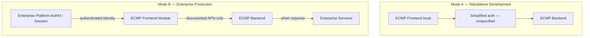
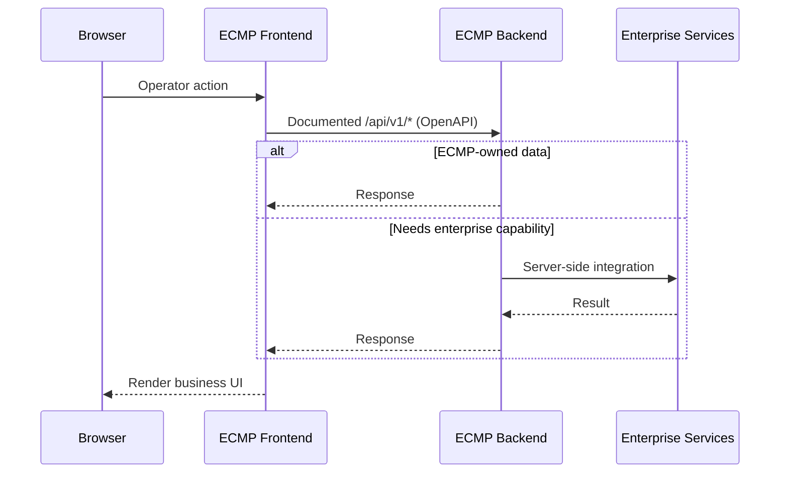

# ECMP Frontend Architecture v1.2

| Field | Value |
|---|---|
| ID | FE-ARCH-001 |
| Program | PROGRAM-FRONTEND-001 |
| Phase | PHASE-0B (Architecture Consolidation — Documentation only) |
| Version | 1.2 |
| Owner | Solution Architect / Frontend Lead |
| Reviewer | Architecture Board / UX Lead / Tech Lead / Security Architect |
| Approver | Architecture Board |
| Lifecycle | BASELINE |
| Status | 🟢 BASELINE |
| Implementation Authorization | AUTHORIZED WITH CONDITIONS (PROGRAM-ADR-002 BR-008) |
| Last Review | 2026-07-30 |
| Next Review | 2026-08-30 |
| Supersedes | FE-ARCH-001 v1.1 (PHASE-0A) |
| Prior reviews | Architecture Board: **PASS** (after PHASE-0A). Independent Review: **PASS WITH CONDITIONS**. Board Resolution PROGRAM-ADR-002 PHASE-0: lifecycle **BASELINE** |

## Document control

| Item | Value |
|---|---|
| Scope | Architecture documentation for the **canonical ECMP product UI** as an **Enterprise Business Module** |
| Non-goals | Application code, new pages/components, backend changes, contract inventing, infrastructure/topology/technology selection for module mounting |
| Canonical tree | `frontend/` (DEC-019) |
| Legacy tree | `implementation/frontend/` (ADR-013 Vite sprint UI — out of product CI scope) |
| Backend contract SoT | Production `backend/` APIs under `/api/v1/*` + OpenAPI under `07 API Catalog/` |
| Related ADRs / DECs | See §Traceability (ADR-008, ADR-014, ADR-015, DEC-019, and supporting ADRs) |

> **PHASE-0B / PROGRAM-ADR-002:** this document is the Architecture Board **BASELINE** for frontend architecture. Implementation Authorization: **AUTHORIZED WITH CONDITIONS** (BR-008).
>
> **Governance sync (PROGRAM-BOARD-004 F-3, 2026-07-30):** ADR-014 v1.4 and ADR-015 v1.3 are **Accepted with Conditions** (BR-009 / BR-010). LAP-01..03 are **Locked** (no longer Pending Upstream). This sync does **not** unlock Mode B / Batch-2 / enterprise customer (**C-7 CLOSED**). OD-FE-002 protocol work remains gated.

---

## Decision classification (how to read this document)

| Class | Meaning |
|---|---|
| **Locked Pending Upstream** | *(Historical class — retired for LAP-01..03 after PROGRAM-BOARD-004.)* Was: binding conditional on ADR-014/015 acceptance. Do not reintroduce for those ADRs while they remain Accepted with Conditions. |
| **Locked architectural principles** | Binding; must not be contradicted without Architecture Board. Includes LAP-01..07 after F-3 sync |
| **Current decisions** | Accepted for product UI architecture (stack tree, API-first, config-first posture) |
| **As-built notes** | Describe code that exists today; may be Mode A / transitional and **must not** redefine production architecture |
| **Open decisions** | Unresolved; tracked in `OPEN_DECISIONS.md` |
| **Future decisions** | Deferred to later architecture workstreams (e.g. Infrastructure Architecture) |
| **Assumptions** | Stated explicitly; invalid if contradicted by platform governance |
| **Out of scope** | Explicitly excluded from FE architecture ownership |

---

## Glossary (terminology)

These terms **must not** be used interchangeably.

| Term | Meaning | Owns (normative sources) |
|---|---|---|
| **Enterprise Platform** | Larger enterprise application platform that hosts multiple business modules (Portal, SSO, shared chrome, enterprise identity). External-to-module shared capabilities. | Authentication, SSO, User Directory, Password/MFA (enterprise), Session, Organization / Branch / Department, Enterprise Navigation, Identity Audit (ADR-014 — **Accepted with Conditions**; Mode B runtime **CLOSED** per C-7) |
| **Core Platform** | ECMP **domain** that provides shared platform capabilities inside the ECMP system boundary (identity/access foundations, audit, platform config). Not the same as Enterprise Platform. | Role, Permission, Role-Permission, User-Role **SoT** (ADR-008 — **Accepted**); audit append-only; platform config surfaces per domain architecture |
| **Business Module** | A domain product mounted in / reachable via the Enterprise Platform. **ECMP (Complaint Management)** is one Business Module. | Complaint, Ticket, Escalation, Assignment, SLA, Resolution, KPI, Complaint-domain audit; **Complaint Roles / Complaint Authorization** mapping after entitlement (ADR-014 / ADR-015 — **Accepted with Conditions**; Mode B runtime **CLOSED** per C-7) |
| **ECMP Frontend** | Operator UI for the ECMP Business Module (`frontend/`). | Module-local UX only; consumes identity and permissions; does not own AuthN or Role-Permission SoT |

### Terminology rules

1. Do **not** assign Core Platform SoT ownership (ADR-008) to the Enterprise Platform without a superseding ADR.
2. Do **not** change business ownership without ADR evidence (AI-RULES-001).
3. “Platform” in UI copy or as-built folders is **not** an ownership claim — use this glossary in architecture documents.

---

## 0. Architectural Principles

### 0.1 Locked principles (ADR-014 / ADR-015 Accepted with Conditions)

ADR-014 v1.4 and ADR-015 v1.3 are **Accepted with Conditions** (PROGRAM-BOARD-004 **BR-009** / **BR-010**). Prior “Locked Pending Upstream” classification for LAP-01..03 is **retired** (F-3 documentation sync). Principles below are **Locked**.

**Hard constraint:** Accept With Conditions does **not** authorize Mode B AuthN implementation, OpenAPI enterprise `securitySchemes`, Batch-2, or enterprise customer enablement (**C-7 CLOSED**). Protocol / conveyance remains OD-FE-002 / ADR-016 track.

| ID | Principle | Upstream |
|---|---|---|
| LAP-01 | ECMP is **not** a standalone application. ECMP is an **Enterprise Business Module** inside a larger Enterprise Platform. | ADR-014 |
| LAP-02 | **Authentication is not owned by ECMP.** Authentication belongs to the Enterprise Platform. ECMP consumes authenticated identity only. | ADR-014, ADR-015 |
| LAP-03 | ECMP owns **business capabilities** (complaint domain). Enterprise identity, authentication, and enterprise navigation are outside ECMP Frontend responsibility. | ADR-014 |

### 0.2 Locked architectural principles (topology / SoT / API flow)

| ID | Principle | Evidence |
|---|---|---|
| LAP-04 | Frontend architecture **MUST remain independent from deployment topology**. Do not assume hostname, domain, subdomain, subpath, reverse proxy, ingress, API gateway, or authentication provider product. Those are infrastructure decisions outside this document. | Architecture Board PHASE-0A; OD-FE-007 |
| LAP-05 | **Role-Permission SoT is Core Platform** (ADR-008). ECMP Frontend must not implement a competing Role/Permission SoT UI. Complaint authorization UX consumes permissions resolved for the module; it does not redefine SoT ownership. | ADR-008 Accepted |
| LAP-06 | Frontend **MUST** support configuration supplied by deployment (no hardcoded infrastructure endpoints). Mechanism is unspecified here. | ADR-003; §12; §Enforcement |
| LAP-07 | Frontend **MUST** call only documented ECMP Backend APIs (`Browser → ECMP FE → ECMP BE → Enterprise Services when required`). | Architecture Board CHANGE-3 |

---

## 1. Vision

### 1.1 Product intent

ECMP Frontend is the **operator UI module** for Enterprise Complaint Management: authenticated staff (CS agents, supervisors, handlers, admins, managers) work complaints, queues, assignments, resolutions, SLA/KPI views, and complaint-domain administration against the ECMP backend.

ECMP is **not** a Customer Master SoR — the UI never invents customer-write flows; customer context is read/reference only unless a future approved write-back exists.

### 1.2 Architectural posture

| Principle | Implication |
|---|---|
| Enterprise Business Module | ECMP UI mounts into / is reachable via any Enterprise Platform entry point without FE business-architecture refactor (see §11, §Module Integration Boundary) |
| Auth boundary | Production (Mode B): consume platform identity; no Login/Register/Forgot/Change Password UI ownership |
| API-first | UI consumes catalogued OpenAPI contracts; no invented endpoints |
| Security by default | AuthN from platform/session; permission-aware rendering is UX only — API / Core Platform enforces AuthZ |
| Configuration-first | Infrastructure values and workflow enums come from config/backend; UI does not hardcode env topology or invent states |
| Modular by feature | Screens live under ECMP feature modules; shared design system stays reusable across enterprise modules |
| Dual-language operator UX | Indonesian-first (`id`) with English (`en`) secondary — see `frontend/docs/I18N.md` |
| Single production tree | Compose, release, and product CI target `frontend/` (DEC-019) |

### 1.3 Personas (scope drivers)

Aligned to `12 UI UX Spec/ECMP_Personas_And_Journeys_v0.1.md` (UX-001):

| Persona | Primary UI surfaces |
|---|---|
| P-01 CS Agent | Create/view complaints, customer reference, notes |
| P-02 Supervisor | Assign/reassign, queue monitoring, review/close paths |
| P-03 Administrator | **Complaint-domain** settings (SLA policy, system config in ECMP scope) — not enterprise identity admin; not Core Platform Role-Permission SoT admin as FE ownership |
| P-04 Handler | Work assigned complaints, escalate/resolve |
| P-05 Manager / Executive | Dashboard, reports/KPI (read-oriented) |

### 1.4 Boundary with legacy UI

| Tree | Role | Stack (as-built) | Status |
|---|---|---|---|
| `frontend/` | **Canonical product UI** | Next.js 15 + React 19 + Tailwind 4 + Axios | Production Compose / release path |
| `implementation/frontend/` | Legacy ECMF case-service sprint UI | Vite + React 18 + TanStack Query + CSS Modules (ADR-013) | Historical / non-product CI |

New product work targets `frontend/`. Legacy track may remain for case-service experiments but must not be treated as the production UI SoT (see OD-FE-001).

---

## 2. Enterprise Module Boundary

### 2.1 Ownership (must not overlap) — corrected PHASE-0B

| Owner | Owns | Does not own |
|---|---|---|
| **Enterprise Platform** | Authentication, SSO, User Directory, Password/MFA (enterprise), Session, Organization, Department, Branch, Enterprise Navigation, Identity Audit | ECMP complaint lifecycle; **Core Platform Role-Permission SoT**; Complaint Roles SoT |
| **Core Platform** (ECMP domain) | Role, Permission, Role-Permission, User-Role **SoT** (ADR-008); platform audit; platform config surfaces per domain architecture | Complaint business rules; Enterprise Identity SoR (under Enterprise Mode / ADR-014) |
| **ECMP Business Module** | Complaint, Ticket, Escalation, Assignment, SLA, Resolution, KPI, Complaint-domain audit; **Complaint Roles / Complaint Authorization** mapping after entitlement (ADR-014) | Login UI; IdP; enterprise org/user SoR; enterprise nav shell; Role-Permission Matrix SoT |
| **ECMP Frontend** | Module-local routes, views, UX permission checks, Shared Design System consumption | AuthN ownership; Role/Permission SoT administration; direct Enterprise Service calls |

### 2.2 Role & Permission ownership disposition (Independent Review finding)

**Finding (Claude / Independent Review):** FE-ARCH v1.1 listed **Role** and **Permission** under Enterprise Platform ownership, which appeared to contradict ADR-008 / ADR-015.

**Verification:**

| Artifact | Status | Statement |
|---|---|---|
| ADR-008 | **Accepted** | Role-Permission Matrix SoT = **Core Platform**; Administration = configurator only |
| ADR-014 | **Accepted with Conditions** (BR-009) | ECMP owns **Complaint Roles** and **Complaint Authorization**; AuthN external; Authorization remains inside ECMP; Mode B runtime **CLOSED** (C-7) |
| ADR-015 | **Accepted with Conditions** (BR-010) | “ECMP roles and permissions \| ECMP (per ADR-008) \| Own”; enterprise role labels do not auto-map to ECMP permissions; Mode B runtime **CLOSED** (C-7) |

**Verdict:** A **documentation contradiction existed in FE-ARCH v1.1**, not an ADR-vs-ADR contradiction on SoT.

- Enterprise Platform does **not** own the Role-Permission Matrix SoT.
- Core Platform owns Role-Permission SoT (ADR-008).
- ECMP owns complaint authorization / complaint role mapping after entitlement (ADR-014 / ADR-015 — Accepted with Conditions; Mode B runtime deferred).
- ECMP Frontend may **display** and **UX-gate** using resolved permissions; enforcement remains backend / Core Platform.

**Correction:** §2.1 and Glossary above replace the v1.1 ownership table. OPEN_DECISIONS “Resolved by PHASE-0A” Role/Permission line is superseded by this disposition.

### 2.3 Responsibility rules

1. Responsibilities **MUST NOT overlap**. If a capability sits with Enterprise Platform or Core Platform SoT, ECMP Frontend must not implement a competing SoT UI for it in **Mode B (Enterprise Production)**.
2. ECMP may **display** identity attributes (e.g. current user display name, org/branch context) supplied by the authenticated session / backend projection — display ≠ ownership.
3. ECMP may **check permissions** for UX (hide/disable) using claims/permissions provided via authenticated identity / backend; AuthZ enforcement remains on the backend / Core Platform.
4. Enterprise navigation (global module switcher, platform chrome) is Enterprise Platform–owned; ECMP provides **module-local** navigation for complaint capabilities only.
5. Administration UI that configures Role-Permission (if present) is a **configurator** of Core Platform SoT (ADR-008), not Enterprise Platform ownership and not FE inventing a second SoT.

### 2.4 Out of scope for ECMP Frontend (production)

- Identity Management / User Registration as enterprise SoR
- Organization / Department / Branch administration as enterprise SoR
- Competing Role & Permission SoT administration (violates ADR-008)
- Authentication provider selection or IdP integration UI
- Login / Register / Forgot Password / Change Password as Mode B product surfaces

---

## 3. Technology Stack

### 3.1 Locked stack (canonical product UI) — Current decision

| Layer | Choice | Rationale |
|---|---|---|
| Runtime | Node.js 20+ (CI pin 20; image may use 22 Alpine) | Matches Root Frontend CI and Docker builder |
| Framework | **Next.js 15** (App Router) | File-based routing, SSR/RSC where useful, standalone runner |
| UI library | **React 19** | As shipped in `frontend/package.json` |
| Language | **TypeScript** (strict project config) | Type safety against OpenAPI-shaped DTOs |
| Styling | **Tailwind CSS 4** + shared theme tokens (`src/shared/theme/`) | Foundation for Shared Design System (§10) |
| HTTP | **Axios** instance + interceptors | Documented backend API client only |
| i18n | **next-intl** | `id` default, `en` secondary; no URL locale prefix |
| Package manager | npm (`package-lock.json`) | Locked installs in CI (`npm ci`) |

> Stack SoT harmonization vs ADR-013 remains **OD-FE-001** (open → recommend Move to ADR). DEC-019 already locks `frontend/` as the production tree.

### 3.2 Explicit non-choices (product UI)

| Not chosen for product UI | Why |
|---|---|
| Vite SPA as production shell | Superseded for product tree by DEC-019; ADR-013 remains for *legacy* track until OD-FE-001 closes |
| TanStack Query as platform mandate | Not required today; tracked as OD-FE-006 |
| Third-party design-system kit as platform SoT | In-repo Shared Design System (§10) is the architectural direction |
| Hard dependency on a specific reverse proxy / ingress / gateway | Forbidden by LAP-04 |
| Module Federation / iframe / Web Component / reverse proxy as mandated mount tech | **Forbidden to decide here** — see Module Integration Boundary |

### 3.3 Backend alignment

| Concern | Backend | Frontend |
|---|---|---|
| API contract | OpenAPI `/api/v1/*` | Clients call documented APIs only |
| Errors | `{ code, message, details? }` | `ApiError` mapping |
| Identity consumption | Session/token validation + permission resolution | Consumes authenticated identity; does not own AuthN |
| AuthZ | Core Platform / ECMP backend enforcement | UX gates only |

### 3.4 Relationship to ADR-013

ADR-013 remains **Accepted** for the Vite + React 18 + TanStack Query + CSS Modules stack used by `implementation/frontend`. It does **not** override DEC-019. Harmonization is OD-FE-001.

---

## 4. Folder Structure

### 4.1 Repository placement

```text
frontend/                      # Canonical product UI (DEC-019)
  Dockerfile
  package.json
  next.config.ts
  messages/                    # id.json, en.json
  public/
  src/
    app/                       # Next.js App Router (module routes)
    auth/                      # Identity consumption helpers (not platform AuthN ownership)
    features/                  # ECMP domain feature modules
    lib/api/                   # HTTP client + resource wrappers + types
    i18n/
    shared/                    # layouts, ui (design system), theme, providers, hooks
  docs/
```

Legacy (non-canonical):

```text
implementation/frontend/       # Vite SPA — ADR-013 / case-service sprint UI
```

### 4.2 `src/` conventions

| Path | Responsibility |
|---|---|
| `app/` | Routes only: thin pages that compose feature views |
| `features/<domain>/` | ECMP domain UI (complaints, queue, assignments, …) |
| `lib/api/` | Transport + DTO types; one module per resource family |
| `auth/` | Session/identity consumption, permission helpers — **not** platform IdP ownership |
| `shared/ui/` | Shared Design System primitives |
| `shared/layouts/` | Module shell layouts (module-local nav; not enterprise platform chrome ownership) |
| `shared/theme/` | Design tokens |
| `shared/providers/` | App-wide providers (toast, loading, i18n) |
| `i18n/` + `messages/` | Locale resolution and copy |

### 4.3 Dependency direction (must hold)

```text
app → features → shared / lib / auth
features ↛ app
shared ↛ features
lib/api ↛ features / app
```

Violations require Architecture review (or a short ADR) before merge. See Architecture Enforcement Requirements.

### 4.4 What must not live in the frontend tree

- Backend business rules / status transition inventing
- Secrets in source or committed `.env`
- Direct database access
- Hardcoded infrastructure URLs / IdP endpoints / hostnames (see §12)
- Duplicate OpenAPI-derived types that diverge from catalog without sync process
- Customer Master write-back UI without approved BR + API
- Production Login / Register / Forgot Password / Change Password / Identity Management as ECMP-owned product surfaces (Mode B)
- Competing Role-Permission SoT administration UI that contradicts ADR-008

---

## 5. Routing Strategy

### 5.1 Model

- **Next.js App Router** file-system routes under `frontend/src/app`
- **Protected application routes** for ECMP business capabilities
- Public **authentication UI routes** are valid only under **Mode A (Standalone Development)** — see §6. They are **not** part of Enterprise Production architecture (Mode B).

### 5.2 Route map — ECMP business capabilities (canonical)

| Route family | Access | Purpose |
|---|---|---|
| Dashboard / home | Protected | Operator summary |
| `/complaints` (+ new/detail/edit) | Protected | Complaint lifecycle |
| `/queue` | Protected | Work queue |
| `/assignments` | Protected | Assignment management |
| `/resolutions` | Protected | Resolution workflow |
| `/attachments` | Protected | Attachment surfaces |
| `/reports` | Protected | Reporting / KPI entry |
| Complaint-domain `/settings` | Protected | ECMP settings (not enterprise identity admin; not Role-Permission SoT ownership) |

Exact paths may evolve with FRD/screen specs; capability ownership remains ECMP business domains only.

### 5.3 Mode A–only routes (as-built / development — not production architecture)

The following exist in as-built `frontend/` for local development convenience. They are **Mode A** and **MUST NOT** be treated as Mode B Enterprise Production requirements:

| Route (as-built examples) | Mode | Note |
|---|---|---|
| `/login`, `/forgot-password`, `/reset-password`, `/change-password` | A only | Simplified / local auth UX — implementation intentionally unspecified for architecture; production must not depend on these |
| Platform User / Identity admin as ECMP SoR | Forbidden in Mode B | Belongs to Enterprise Platform |
| Competing Role-Permission SoT admin | Forbidden | Violates ADR-008 |

### 5.4 Navigation & deep links

- **Module-local** sidebar/header for ECMP capabilities
- Enterprise Platform navigation remains Platform-owned (LAP-03)
- Deep links to complaint entities must tolerate 403/404 via feature `ErrorState`
- Locale is **not** part of the URL path (next-intl without prefix)
- Absolute public URLs / hostnames are **not** architecture SoT (LAP-04, §11)

### 5.5 Legacy route note

`implementation/frontend` uses React Router (`/`, `/cases/:caseId`). Those routes are **not** part of the product routing SoT.

---

## 6. Enterprise Authentication Boundary

### 6.1 Two architecture modes (CHANGE-1)

ECMP Frontend documents **exactly two** authentication architecture modes.

#### Mode A — Standalone Development

| Field | Value |
|---|---|
| Purpose | Enable local frontend development |
| Auth mechanism | MAY use a **simplified authentication mechanism** |
| Implementation detail | **Intentionally unspecified** in this architecture |
| Production dependency | **FORBIDDEN** — Production architecture MUST NOT depend on Mode A mechanisms |
| Allowed examples (non-normative) | Local login form calling backend auth endpoints, static/dev tokens under local policy, mocks |

Mode A exists only to unblock developers. It is not a third production auth design.

#### Mode B — Enterprise Production

| Field | Value |
|---|---|
| Owner of Authentication | **Enterprise Platform** (Locked — ADR-014 Accepted with Conditions; Mode B runtime **CLOSED** per C-7) |
| ECMP MUST NOT implement | Login UI, Register, Forgot Password, Change Password, User Registration, Identity Management |
| ECMP MUST | Consume authenticated identity; validate authenticated session/token (via backend contracts); check permissions for UX; provide business functionality |



### 6.2 Identity consumption rules (Mode B)

| Rule | Detail |
|---|---|
| AuthN ownership | Enterprise Platform (ADR-014/015 Accepted with Conditions; Mode B runtime **CLOSED** per C-7) |
| Identity contract | ADR-015 is SoT for claims / fail-closed rules (Accepted with Conditions); runtime enforcement deferred until Mode B unlock |
| Token/session storage specifics | Implementation detail; must follow Security Standards when chosen — protocol choice is OD-FE-002 |
| Permission checks | UX only from provided identity/permissions; **never** the security boundary |
| 401 / expired session | Recover via platform session rules / backend-documented refresh — not by inventing ECMP IdP flows |
| Logout | Platform-owned session end; ECMP clears local module session state only |

### 6.3 As-built note (transitional evidence — not Mode B SoT)

Current `frontend/` code uses backend `/api/v1/auth/login|refresh|logout|me` with in-memory access token + HttpOnly refresh cookie patterns. This is documented as **as-built / Mode A–compatible development posture**. It does **not** authorize ECMP to own production Login/Register/Forgot/Change Password UI under Mode B.

Target shared-environment security design remains described by ADR-012 / SEC-AUTH-001; browser protocol shape is **OD-FE-002**. Reconciliation of ADR-007/012 with ADR-014 remains an upstream Architecture Board concern (not invented here).

### 6.4 AuthZ UX mapping

Client visibility follows Role Access Matrix (`10 Security and Access Standards/`). Examples:

- Missing complaint permissions → read-only or hidden actions
- 403 on action → inline/feature error
- 401 → session recovery per mode (Mode A local re-auth vs Mode B platform session), not a “permission denied” page

---

## 7. API Ownership

### 7.1 Normative request flow (CHANGE-3)

```text
Browser
  → ECMP Frontend
    → ECMP Backend
      → Enterprise Services (when required)
```

| Rule | Status |
|---|---|
| Frontend MUST NOT bypass ECMP Backend | Locked (LAP-07) |
| Frontend MUST NOT access databases directly | Locked |
| Frontend MUST communicate only through documented backend APIs | Locked |
| Frontend MUST NOT call Enterprise Services directly | Locked |



### 7.2 Contract rules

1. **OpenAPI catalog is SoT** (`07 API Catalog/openapi/`).
2. Frontend wrappers under `src/lib/api/*` must mirror catalog paths/fields.
3. **No new backend endpoints** from frontend workstreams without catalog + FRD first (AI-RULES).
4. API base URL and related infrastructure values come from **configuration** (§12), never hardcoded hostnames in architecture or source.

### 7.3 Client architecture

```text
Feature view / hook
    → lib/api/<resource>.ts
        → HTTP client (interceptors)
            → ECMP Backend documented APIs
```

| Concern | Behavior |
|---|---|
| Auth header / credentials | Per chosen session/token mode (OD-FE-002); always toward ECMP Backend only |
| Errors | Map to `ApiError{status, code, message, details}` |
| Loading / toasts | Cross-cutting UX providers |

### 7.4 Domain API families (ECMP consumers)

Non-exhaustive; expands only with catalogued APIs in ECMP ownership:

| Family | UI features |
|---|---|
| Complaints / tickets / queues | Lifecycle + queue |
| Assignments / resolutions / escalations | Work management |
| SLA / KPI / attachments / audit | Ops + reporting |
| Auth/session consumption endpoints | Identity consumption only (not platform AuthN ownership) |

Enterprise User/Org SoR APIs remain Enterprise Platform–owned under Enterprise Mode; Core Platform Role-Permission APIs remain Core Platform SoT; ECMP consumes projections needed for complaint work via ECMP Backend.

### 7.5 Local development connectivity (assumption — not topology SoT)

Developers may point the configured API base at a local backend process. Specific hostnames, ports, proxies, and ingress layouts are **out of FE architecture** (LAP-04; OD-FE-007).

### 7.6 Legacy case-service UI

`implementation/frontend` talks to `case-service` with Vite proxy patterns. That path is **orthogonal** to product `/api/v1` integration and must not be mixed into `frontend/` without an explicit migration ADR.

---

## 8. State Management

### 8.1 Layered state model

| State class | Mechanism | Examples |
|---|---|---|
| Authenticated identity | Context / module session store | user projection, roles, permissions, status |
| Access credential (if any) | In-memory preferred for bearer secrets | HTTP Authorization toward ECMP Backend |
| Locale | next-intl + preference storage | `id` / `en` |
| Cross-cutting UX | Providers (Toast, GlobalLoadingBar) | network toasts, pending bar |
| Screen / feature data | Feature hooks + local React state | list filters, detail entity, form drafts |
| URL state | App Router searchParams / path params | entity ids, optional filters |

### 8.2 Rules

1. **Server is source of truth** for domain entities after successful mutations.
2. Prefer **pessimistic UI** for business-significant transitions (assign, status, close, escalate).
3. Do not introduce a global Redux/Zustand store by default.
4. TanStack Query is **optional** until OD-FE-006 closes.
5. Derived permission visibility is computed from authenticated identity + entity fields; never cache “canAct” across sessions without refresh.

### 8.3 Form state

- Controlled inputs in feature views
- Client-side required-field checks are UX accelerators only
- Server `VALIDATION_ERROR.details` maps to field errors; preserve user input on 400

---

## 9. Error Handling

### 9.1 Envelope

| Field | Use |
|---|---|
| `status` | HTTP status |
| `code` | Machine code |
| `message` | Fallback human string |
| `details` | Field-level map for validation |

### 9.2 Placement matrix

| Situation | Placement | User treatment |
|---|---|---|
| 401 unauthenticated | Global / auth shell | Mode-appropriate session recovery |
| 403 on page load | Page `ErrorState` | “No access” + navigate home/back |
| 403 on action | Inline / toast near action | Explain; keep context visible |
| 404 entity | Page `ErrorState` | Not found + back CTA |
| 400 validation | Field errors | Preserve form values |
| 409 conflict / invalid transition | Inline + resync entity | Re-fetch or replace from server |
| 5xx / network | Toast and/or inline retry | Manual retry; no silent infinite auto-retry |
| Unexpected render errors | Route/error boundary | Safe fallback page |

### 9.3 Logging & observability

- Do not log tokens or PII to browser console in production builds
- Correlate with backend request id when exposed
- Expected AuthZ outcomes are UX, not incidents

### 9.4 i18n of errors

Prefer message-catalog keys for known `code` values; fall back to sanitized `message`. Never render raw stack traces to operators.

---

## 10. Shared Design System

### 10.1 Purpose (CHANGE-4)

ECMP Frontend maintains an in-repo **Shared Design System** under `src/shared/` that must be **reusable by future Enterprise Modules** (Knowledge, Inventory, HR, CRM, Analytics, …). ECMP business features consume the system; they do not fork one-off visual languages per screen without cause.

### 10.2 Catalog (architectural coverage)

| Area | Architectural requirement |
|---|---|
| Design Tokens | Central tokens for color, space, type, radius, elevation — no ad-hoc magic values when a token exists |
| Typography | Shared type scale and semantic text styles |
| Color System | Semantic colors (surface, text, border, status) — color not sole status signal |
| Spacing | Consistent spacing scale |
| Icons | Shared icon approach / set usage rules |
| Buttons | Primary/secondary/destructive/ghost patterns |
| Forms | Layout, labels, validation display patterns |
| Inputs | Text, select, and related field primitives |
| Tables | Sort/filter/empty/loading patterns for operator data |
| Cards | Use only when interaction/understanding requires a container (prefer non-card layouts otherwise) |
| Modal | Confirm and focused task dialogs |
| Toast | Transient success/error/info |
| Navigation Components | **Module-local** nav primitives; enterprise chrome remains Platform-owned |
| Responsive Layout | Desktop-first operator tool; usable tablet; mobile acceptable for read/light actions |
| Accessibility Baseline | Semantic controls, focus-visible, keyboard dialogs, non-color-only status |

### 10.3 Interaction standards

| Pattern | Expectation |
|---|---|
| Loading | Page skeleton/fallback; button/inline pending; optional global bar |
| Empty | Explicit empty components with actionable copy |
| Errors | `ErrorState` / Alert / Toast per severity; distinguish 403 vs 404 |
| Confirm | Modal confirm for irreversible / high-impact actions |
| Permissions | Hide clearly inapplicable actions; explain 403 without losing context |
| i18n | Operator-facing strings via message catalogs |

### 10.4 Quality bar

- CI path for product UI: `root-frontend-ci.yml` — typecheck + lint + **unit/coverage (Phase C hard)** + build; audit + a11y (warn). Policy: FE-CI-POL-001 **v1.0 Accepted with Conditions** (OD-FE-003 CLOSED).
- Screen specs: prefer `12 UI UX Spec/` (OD-FE-005)

### 10.5 Out of scope UI

- External customer channel apps (Blueprint out of scope)
- Speculative published npm design-system packages before Architecture approval
- Live websocket dashboards unless FRD + API/event subscription exists
- Enterprise Platform chrome / global navigation ownership

---

## 11. Enterprise Module Entry Point

### 11.1 Architectural requirement only (CHANGE-5)

ECMP **must be deployable behind any Enterprise Platform entry point without frontend business-architecture refactoring**.

This document intentionally does **NOT** define:

- subdomain / subpath / hostname / domain
- gateway / ingress / reverse proxy
- Module Federation / iframe / Web Component / other mount technologies

Those decisions have **not** been made and belong to future **Infrastructure Architecture** / integration ADR work (see OD-FE-007).

### 11.2 Implications for FE design

| Requirement | Implication |
|---|---|
| Path/base independence | App must tolerate platform-chosen base path / host via configuration, not hardcoded constants |
| Auth independence | Entry may already be authenticated (Mode B); FE must not require its own login route to function in production |
| Asset / API resolution | Resolved from configuration (§12), not baked topology assumptions |
| No FE refactor for topology change | Changing how the platform exposes ECMP must not require rewriting ECMP business architecture |

### 11.3 Future decision

**OD-FE-007 — Enterprise Module Deployment Strategy** remains OPEN until Infrastructure Architecture decides topology.

---

## 11A. Module Integration Boundary (PHASE-0B)

Architectural seam between **Enterprise Platform** and **ECMP** — ownership and responsibilities only. **No technology selection.**

### Ownership

| Side | Owns |
|---|---|
| Enterprise Platform | Hosting entry, enterprise chrome/navigation, AuthN/session presentation, enterprise identity issuance |
| ECMP Business Module | Complaint capabilities, module-local navigation, complaint AuthZ mapping after entitlement |
| ECMP Frontend | Presentation of ECMP capabilities; identity/permission consumption; config-driven base/API resolution |
| Integration decision owner (future) | Infrastructure Architecture + Platform Architecture + Solution Architect (OD-FE-007) |

### Integration boundary

```text
Enterprise Platform trust domain
  |  presents authenticated identity + module entry
  v
ECMP Frontend (Business Module UI)
  |  documented APIs only
  v
ECMP Backend
  |  when required
  v
Enterprise Services
```

Crossing the boundary does **not** transfer:

- Enterprise Identity SoR to ECMP
- Role-Permission SoT from Core Platform to Enterprise Platform
- Complaint business ownership to the Enterprise Platform

### Responsibilities

| Concern | Responsible party |
|---|---|
| Authenticate user | Enterprise Platform (Mode B) |
| Present identity claims | Enterprise Platform → consumed per ADR-015 when Accepted |
| Entitlement to Complaint module | Enterprise Platform / gate per ADR-014 |
| Map identity → ECMP roles/permissions | ECMP (ADR-008 / ADR-014) |
| Render complaint UX | ECMP Frontend |
| Enforce AuthZ on mutations | ECMP Backend / Core Platform |
| Choose mount technology | **Future work — not this document** |

### Extension points (technology-agnostic)

1. **Identity consumption point** — FE receives authenticated identity for Mode B without owning AuthN UI.
2. **Configuration injection point** — deployment supplies API/base/asset configuration (mechanism TBD).
3. **Module navigation contribution** — ECMP exposes module-local nav; platform owns global switcher.
4. **Design system reuse** — Shared Design System primitives intended for other business modules.
5. **Backend façade** — all enterprise service access remains server-side via ECMP Backend.

### Explicit non-decisions

Do **not** treat any of the following as decided by FE-ARCH-001:

- Module Federation
- iframe embedding
- Web Components
- Reverse proxy pathing
- API Gateway product choice

---

## 12. Enterprise Configuration & Runtime Configuration Principle

### 12.1 Principles (CHANGE-6 + PHASE-0B)

Frontend **MUST NOT hardcode**:

- API URLs
- Identity Provider endpoints
- Authentication endpoints
- Environment URLs
- Deployment hostnames

**Runtime / deployment configuration principle (architectural only):**

> The frontend **must support configuration provided by deployment**. Values that vary by environment or topology (API base, public base path/asset base, environment name, Mode A vs Mode B switches where applicable) **must be injectable by the deploying party**.

This document does **NOT** decide:

- build-time vs runtime injection mechanism
- specific env var names as permanent SoT (as-built names are illustrative)
- secret distribution mechanism
- config service product

### 12.2 Configuration classes

| Class | Examples | Owner |
|---|---|---|
| Infrastructure | API base URL, public asset base, environment name | Platform / ops via deployment config |
| Auth integration (Mode B) | How to read platform session / token bridge | Platform + Security (OD-FE-002) |
| Auth convenience (Mode A) | Local-only simplified auth switches | Dev only; never production dependency |
| Product | Feature flags for ECMP capabilities (if any) | ECMP product governance |

### 12.3 As-built evidence (non-normative for topology)

Current tree uses environment variables such as `NEXT_PUBLIC_API_BASE_URL`. That pattern illustrates config-supply; it does **not** freeze a particular hostname, proxy, IdP, or injection strategy.

---

## 13. Future Enterprise Expansion

### 13.1 Goal (CHANGE-7)

The same architecture must support adding future Enterprise Modules **without modifying existing ECMP business architecture**.

Non-exhaustive examples:

- Knowledge
- Inventory
- HR
- CRM
- Analytics

### 13.2 Adoption model

| Layer | Shared across modules | Module-specific |
|---|---|---|
| Principles (LAP-01..07) | Yes | — |
| Auth Mode A / Mode B boundary | Yes | — |
| API ownership flow (Browser → Module FE → Module BE → Enterprise Services) | Yes | — |
| Shared Design System | Yes (extend tokens/primitives carefully) | Domain components only |
| Configuration principles | Yes | Module config keys |
| Business features / routes / domain state | — | Yes (isolated per module) |
| Role-Permission SoT | Core Platform (ADR-008) across modules | Module maps/uses permissions; does not fork SoT |

### 13.3 Non-goals for expansion

- Rewriting ECMP complaint domain when a new module lands
- Sharing business stores across unrelated modules by default
- Letting a new module reintroduce standalone production AuthN ownership
- Letting a new module create a second Role-Permission SoT

---

## 14. Build, CI & Release (delivery notes)

### 14.1 Local development

Mode A allowed. Developers configure API base via env/config and run the canonical `frontend/` toolchain. Specific ports/hosts are local convenience, not architecture SoT.

### 14.2 CI

| Workflow | Tree | Gates (current) |
|---|---|---|
| `.github/workflows/root-frontend-ci.yml` | `frontend/` | `npm ci` → typecheck → production build |
| `.github/workflows/frontend-ci.yml` | `implementation/frontend/` | Legacy Vite gates |

Product PRs that only change `frontend/` must stay green on **Root Frontend CI**. Broader quality bar: OD-FE-003. Architecture enforcement requirements (§16) are **requirements only** — not implemented in this phase.

### 14.3 Container & compose (as-built evidence — not topology SoT)

Docker/Compose artifacts may exist for local or interim delivery. FE architecture **does not** mandate a particular reverse proxy, ingress, gateway, or hostname layout (LAP-04, OD-FE-007).

### 14.4 Release hygiene

- No secrets in image layers or git
- Contract changes ship with OpenAPI + traceability updates before UI consumption expands
- Rollback via previous immutable artifact; backend compatibility window must be maintained

---

## 15. Non-Functional Architecture (PHASE-0B)

High-level objectives only — no implementation prescriptions.

### 15.1 Performance objectives

- Operator UI remains usable on typical enterprise desktop networks for core complaint workflows (list, detail, assign, status change).
- Perceived performance: prioritize fast first interaction for queue/complaint detail over decorative assets.
- Avoid architecture that requires N+1 chatty browser calls to Enterprise Services (forbidden by API ownership — all via ECMP Backend).
- Bundle/route design should allow feature-level code splitting as delivery matures (mechanism TBD).

### 15.2 Scalability considerations

- Scale-out of FE delivery is an infrastructure concern; FE architecture must not embed single-host assumptions (LAP-04).
- Multi-module expansion must not require rewriting ECMP business architecture (§13).
- AuthZ and identity load remain backend/platform concerns; FE must not invent a client-side permission SoT cache that diverges from Core Platform.

### 15.3 Accessibility target

- Baseline: keyboard operable primary flows; visible focus; semantic controls; status not conveyed by color alone (§10.2).
- Formal WCAG level / audit cadence: **WCAG 2.2 Level AA** working target (`docs/frontend/FRONTEND_CI_QUALITY_POLICY_v1.0.md`, OD-FE-009 CLOSED). Do **not** claim product WCAG AA conformance without UX audit evidence (FE-CI-POL-CS-001 C-3). Baseline above remains mandatory.

### 15.4 Observability principles

- Correlate operator-facing failures with backend request identifiers when exposed by API.
- Prefer structured client error reporting suitable for ops triage without logging secrets or unnecessary PII.
- Distinguish expected AuthZ denials (UX) from unexpected failures (incident candidates).

### 15.5 Error reporting principles

- User-visible errors follow §9 matrix (401/403/404/400/409/5xx).
- Production builds must not expose stack traces or tokens to operators.
- Error reporting pipelines (if introduced later) must be configurable by deployment and must not hardcode vendor endpoints in source (align §12).

---

## 16. Architecture Enforcement Requirements (PHASE-0B)

**Requirements only.** Do **not** treat this section as implemented CI.

| ID | Rule | Suggested enforcement class |
|---|---|---|
| AEN-01 | Dependency direction: `app → features → shared/lib/auth`; forbid `features → app`, `shared → features`, `lib/api → features/app` | Static import/boundary lint |
| AEN-02 | Forbidden imports: FE must not import backend packages, database clients, or legacy `implementation/frontend` modules into product `frontend/` | Static boundary lint |
| AEN-03 | Production authentication mode: Mode B builds/deployments must not depend on Mode A login routes as the only entry | Config/build policy + review checklist |
| AEN-04 | Forbidden hardcoded infrastructure endpoints (API base, IdP, auth URLs, hostnames) in source | Lint / secret-and-URL policy |
| AEN-05 | API calls only to documented ECMP Backend paths (no direct Enterprise Service hosts from browser) | API client allowlist / review |
| AEN-06 | No secrets committed (`.env` with credentials, private keys) | Secret scanning |
| AEN-07 | OpenAPI drift: generated or hand wrappers must not silently diverge without catalog update process | Contract check (future) |

Implementation of gates is tracked under OD-FE-003 (and related delivery work). This phase produces requirements only.

---

## Traceability & references

### Upstream ADR / DEC matrix (PHASE-0B TASK-1)

| Artifact | Status (repo) | Required by FE-ARCH? | Referenced? | Notes |
|---|---|---|---|---|
| **ADR-008** | Accepted | **Yes** — Role-Permission SoT; AuthZ UX boundary | **Yes** (Glossary, §2, LAP-05) | Was missing as normative SoT in v1.1 related list |
| **ADR-014** | **Accepted with Conditions** (BR-009) | **Yes** — Enterprise Business Module / AuthN ownership | **Yes** (LAP-01..03 Locked, §6, §11A) | Architecture Accepted; Mode B runtime **CLOSED** (C-7) |
| **ADR-015** | **Accepted with Conditions** (BR-010) | **Yes** — Identity contract for Mode B consumption | **Yes** (LAP-02 Locked, §6.2, §11A) | Bilateral Contract (C-3); Mode B runtime **CLOSED** (C-7) |
| **ADR-019** | **Does not exist** | N/A | N/A | No ADR-019 in `05 Architecture Decision Records/`; no action |
| **DEC-019** | Accepted | **Yes** — canonical `frontend/` tree | **Yes** | Binding |
| ADR-003 | Accepted | Supporting — configuration-first | **Yes** (§12) | Reinforces runtime config principle |
| ADR-007 | Accepted | Supporting — slice AuthN (DEV/CI); reconcile with Enterprise Mode upstream | **Yes** (as-built / OD-FE-002) | Relationship Pending with ADR-014 |
| ADR-012 | Accepted | Supporting — target AuthN architecture (SEC-AUTH-001); reconcile with Enterprise Mode upstream | **Yes** (as-built / OD-FE-002) | Relationship Pending with ADR-014; do not treat as Proposed |
| ADR-011 | Accepted | Historical deferral context | **Yes** | |
| ADR-013 | Accepted | Legacy stack track | **Yes** | Harmonize via OD-FE-001 |
| SEC-AUTH-001 | Active security std | Supporting | **Yes** | |

### Other references

| Artifact | Role |
|---|---|
| UX-001 / UX-SCR-001 | Personas + case detail screen (legacy track) |
| `frontend/SPRINT_F*.md` | Product UI sprint foundations |
| `07 API Catalog/openapi/` | API SoT |
| `10 Security and Access Standards/` | AuthN/AuthZ, role matrix |
| `20 Domain Architecture/Core Platform/` | Core Platform ownership evidence |
| `21 Technical Standards/` | Activate TypeScript/React standards as follow-up (OD-FE-004) |
| `docs/frontend/OPEN_DECISIONS.md` | Remaining open decisions |

### Traceability updates performed

- Added ADR-008 / ADR-014 / ADR-015 / DEC-019 to normative FE-ARCH references.
- Documented ADR-019 as non-existent (N/A).
- Corrected Role/Permission ownership to match ADR-008 (+ ADR-014/015 complaint AuthZ).
- **PROGRAM-BOARD-004 F-3 (2026-07-30):** synced ADR-014/015 status to **Accepted with Conditions**; retired LAP-01..03 “Pending Upstream”; Mode B remains **CLOSED** (C-7). Did **not** authorize Mode B implementation.

---

## PHASE-0B Consolidation register

### Accepted Independent Review findings

| Finding | Disposition |
|---|---|
| Missing / weak ADR-008 / ADR-014 / ADR-015 / DEC-019 traceability | **Accepted** — matrix added; references updated |
| Role/Permission ownership listed under Enterprise Platform contradicts ADR-008/015 | **Accepted** — documentation corrected; see §2.2 |
| Overlapping terminology (Enterprise Platform vs Core Platform vs Business Module) | **Accepted** — Glossary added; ownership unchanged without ADR |
| ADR-014 / ADR-015 not Accepted → FE must not over-claim LOCKED | **Accepted** *(PHASE-0B historical)* — LAP-01..03 were Locked Pending Upstream; **superseded by F-3** (now Locked after Accept With Conditions) |
| Need explicit module integration seam without choosing mount tech | **Accepted** — §11A |
| Runtime configuration as architectural principle | **Accepted** — §12.1 |
| Architecture rules needing automatic enforcement | **Accepted** — §16 requirements only |
| Non-functional architecture section missing | **Accepted** — §15 |
| Open Decisions need owner / reason / phase | **Accepted** — OPEN_DECISIONS.md revised |

### Rejected Independent Review findings / recommendations

| Finding / recommendation | Why rejected |
|---|---|
| Treat ADR-014 / ADR-015 as Accepted because FE Board locked principles | **Rejected** *(PHASE-0B historical)* — inventing acceptance from FE alone was forbidden; **later satisfied** by PROGRAM-BOARD-004 BR-009 / BR-010 (not by FE inventing status) |
| Move Role-Permission SoT to Enterprise Platform to “align with enterprise” | **Rejected** — contradicts Accepted ADR-008; no superseding ADR |
| Decide Module Federation / iframe / Web Component / proxy now | **Rejected** — out of scope for FE-ARCH; OD-FE-007 / future infra ADR |
| Decide runtime config injection mechanism / build strategy now | **Rejected** — principle only (§12); mechanism is future delivery/infra |
| Implement CI enforcement in this phase | **Rejected** — PHASE-0B is documentation; OD-FE-003 tracks gates |
| Invent ADR-019 | **Rejected** — artifact does not exist; no fabricated ID |

### New ADR recommendations (not authored in this phase)

| Recommended ADR topic | Why |
|---|---|
| Product frontend stack supersession / amendment of ADR-013 | Close OD-FE-001; align Accepted stack ADR with DEC-019 + `frontend/` Next.js |
| Enterprise Module deployment / integration technology | Close OD-FE-007 after infra options analysis (mount tech + topology) |
| Identity conveyance / protocol binding (Mode B browser) | Close OD-FE-002; keep subordinate to ADR-015 claims; Mode B runtime still **CLOSED** (C-7) until Board unlock |
| ~~ADR-014 / ADR-015 Architecture Board acceptance~~ | **Done** — PROGRAM-BOARD-004 BR-009 / BR-010; OD-FE-008 CLOSED; LAP Pending Upstream removed (F-3) |

---

## Compliance checklist (PHASE-0B)

- [x] ADR traceability reviewed (008/014/015/019/DEC-019)
- [x] Glossary: Enterprise Platform / Core Platform / Business Module
- [x] Role & Permission ownership verified vs ADR-008 / ADR-015; FE docs corrected
- [x] Upstream ADR-014/015 **Accepted with Conditions** (PROGRAM-BOARD-004); FE wording synced — LAP-01..03 Locked (F-3); Mode B remains **CLOSED**
- [x] Module Integration Boundary documented without technology choice
- [x] Runtime configuration principle documented without mechanism choice
- [x] Architecture enforcement requirements listed (no CI implemented)
- [x] Non-functional architecture section added
- [x] Open Decisions reviewed with disposition
- [x] No application code / backend / FE implementation changed
- [x] Architecture Board countersign of FE-ARCH-001 v1.2 consolidation → lifecycle **BASELINE** (PROGRAM-ADR-002 BR-003); Implementation Authorization **AUTHORIZED WITH CONDITIONS** (BR-008)
- [x] Upstream acceptance of ADR-014 and ADR-015 recorded (PROGRAM-BOARD-004); OD-FE-008 CLOSED — **does not** unlock Mode B (C-7)

---

## Document history

| Version | Date | Notes |
|---|---|---|
| 1.0 | 2026-07-30 | PROGRAM-FRONTEND-001 PHASE-0 initial architecture for review |
| 1.1 | 2026-07-30 | PHASE-0A Architecture Revision — PASS WITH REQUIRED CHANGES (CHANGE-1..7) |
| 1.2 | 2026-07-30 | PHASE-0B Architecture Consolidation — Independent Review PASS WITH CONDITIONS disposition |
| 1.2 | 2026-07-30 | PROGRAM-ADR-002 PHASE-0 Board Resolution: Lifecycle → BASELINE; Implementation Authorization → AUTHORIZED WITH CONDITIONS |
| 1.2 | 2026-07-30 | PROGRAM-BOARD-004 F-3 governance sync: ADR-014/015 Accepted with Conditions; LAP-01..03 Locked (Pending Upstream retired); Mode B / Batch-2 / enterprise customer remain CLOSED (C-7); OD-FE-008 CLOSED |
| 1.2 | 2026-07-30 | FE-CI-POL-001 v1.0 Accepted with Conditions (FE-CI-POL-CS-001); OD-FE-003/009/010 CLOSED; WCAG 2.2 AA working target (no conformance claim) |
